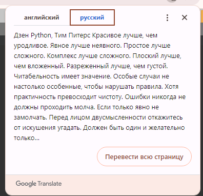
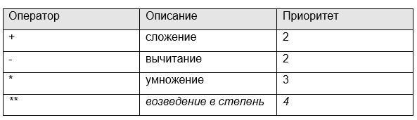
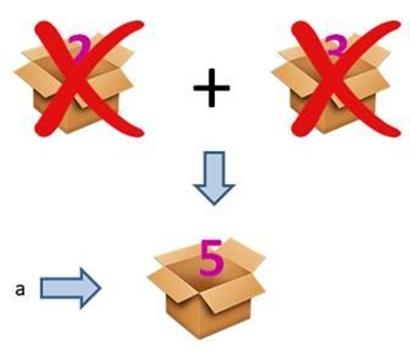
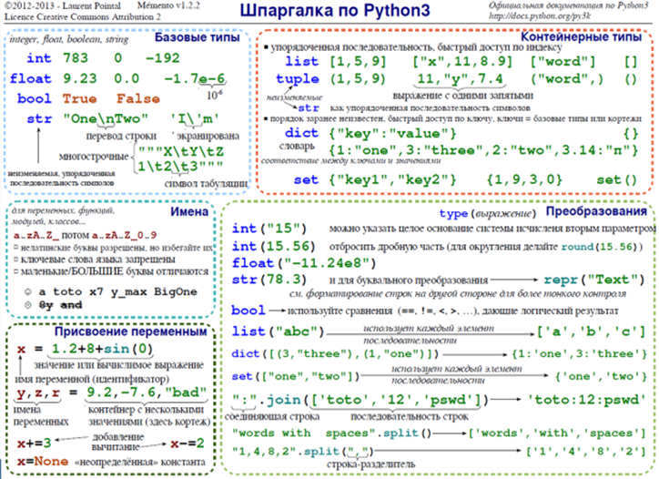
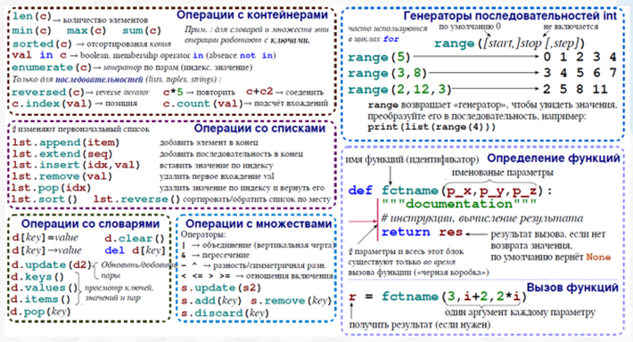

### [Серов Николай Евгеньевич](https://www.specialist.ru/trainer/%D1%81%D0%B5%D1%80%D0%BE%D0%B2)

## Установка интерпретатора Python:

* набираем в поисковике: `python download`
* переходим на [https://www.python.org/downloads/](https://www.python.org/downloads/)
* выбираем ОС и скачиваем программу
* при установке следуем инструкции преподавателя.


## Python online

* набираем в поисковике: `python online`
* переходим на [https://www.onlinegdb.com/online_python_compiler](https://www.onlinegdb.com/online_python_compiler/)
* F9 для выполнения кода


## print 

Часто целью программ является не вывод всех промежуточных результатов, а только требуемого конечного значения.

Но как его вывести? Для этого в языке Python существует специальная функция print(). 

Если все наши арифметические операции записать в виде:

```python
print(2 + 3)
print(8 / 3)
print(5 * 6)
```
то в консоли увидим три строчки, три вывода. 

В интерактивном режиме, кстати, она работает абсолютно также – выводит некоторое сообщение в консоль. 

На данный момент, просто запомните, то, что находится внутри круглых скобок функции `print()`, та информация и выводится. 

Причем, эту функцию можно записать и с пустыми скобками:
print()

Тогда просто отобразится пустая строка. Также можно просто указать число:

```python
print(5)
print(5.6)
# или строку:
print("hello")
```

Пока это просто демонстрация возможностей функции `print()`. 

Подробнее мы о ней еще поговорим. 

А до тех пор будем использовать в таком простом виде.

Python настолько крут, что у него есть своя философия или дзен.

Хотите на него взглянуть? 

Конечно хотите! Для этого откройте IDLE и в интерактивном режиме наберите команду

> import this



### Основные арифметические операции

Пока такого понимания чисел будет вполне достаточно. Следующим шагом, нам с вами нужно научиться делать арифметические операции над ними. Что это за операции? Базовыми из них являются, следующие:





Давайте, я поясню их работу на конкретных примерах.
В самом простом варианте мы можем просто сложить два целых числа:

> 2 + 3

Получим результат 5.

Но этот результат у нас нигде не сохраняется. 

Чтобы иметь возможность делать какие-либо действия с пятеркой, ее следует сохранить через переменную, например, вот так:

> a = 2 + 3

Теперь a ссылается на объект с числом 5.

Давайте разберемся, как работает эта строчка. 

Сначала в `Python` создаются два объекта со значениями `2 и 3`.

Оператор сложения берет эти значения, складывает их и формирует третий объект со значением `5`. 

А, затем, через оператор присваивания, этот объект связывается с переменной `a`. 

В конце, если на объекты `2 и 3` не ссылаются никакие другие переменные, они автоматически удаляются из памяти сборщиком мусора.





Возможно, вас удивило, что при такой простой операции сложения двух чисел выполняется столько шагов. 

Но в Python реализовано все именно так. 

И это справедливо для всех арифметических операций. 

Мало того, раз операция сложения возвращает объект с результатом, то можно сделать и такое сложение из трех чисел:
```python
b = 2 + 3 + 4
```
И так далее, можно записать сколько угодно операций сложения в цепочку.

Давайте теперь сложим целое число с вещественным:

```python
c = 2 + 3.5
```
Очевидно, что результат получается тоже вещественным. Отсюда можно сделать вывод, что сложение целого числа с вещественным всегда дает вещественное значение.
А вот при делении двух любых чисел, мы всегда будем получать вещественное число (даже если числа можно разделить нацело):

```python
d1 = 8 / 2
d2 = 3 / 6
```
Последняя арифметическая операция – это возведение в степень. Она работает просто:

```python
2 ** 3  # возведение в куб
36 ** 0.5  # 36 в степени 1/2 (корень квадратный)
2 ** 3 ** 2 # 2^3^2 = 512
```
В последней строчке сначала 3 возводится в квадрат (получаем 9), а затем, 2 возводится в степень 9, получаем 512. 

То есть, оператор возведения в степень выполняется справа-налево. 

Тогда как все остальные арифметические операции – слева-направо.


### Шпаргалки по Python


