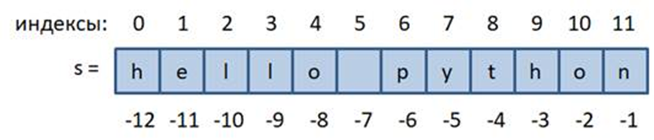

## Строка как последовательность. Индексы, срезы(slice).

Как вы уже знаете, в Python строку можно задавать, например, так:

```python
s = "hello python"
```




и она представляет собой упорядоченный набор символов. 

Что значит упорядоченный? 

Смотрите, каждый символ строки имеет свой уникальный, порядковый номер.

Эти номера называются `индексами`. 

Первый – 0, второй – 1 и так до конца. 

Мы можем использовать эти индексы для обращения к отдельному символу строки. 

Для этого, записывается имя переменной и в квадратных скобках указывается номер символа:

```python
s[0]
s[1]
```
Но будьте внимательны, если указать несуществующий индекс:

```python
s[12]
```

то получим ошибку выхода за пределы диапазона. В нашем случае последний индекс равен 11, а мы записали 12. Чтобы взять последний символ нам следовало бы записать:

```python
s[11]
```

То есть, последний индекс равен длине строки минус один:

```python
len(s) - 1
```
И, по идее, мы могли бы его так и указать в квадратных скобках:

```python
s[len(s) - 1]
```

Эта конструкция работает для строк произвольной длины (кроме нулевой, когда символов нет).
Но в Python то же самое можно записать проще, используя отрицательные индексы:

```python
s[-1]
```

То есть, длину строки `len(s)` можно опускать и записывать отрицательные значения. 

Получаем способ индексации с конца строки.

Причем индексацию можно выполнять также и непосредственно над строками, например:

```python
"panda"[3]
```

вернет 4-й символ этой строки. 
Иногда это тоже может быть полезно.

## Срезы

Фактически, когда мы выполняем индексацию, то возвращается новая строка из одного выделенного символа. 

Но мы можем выделять и сразу несколько символов, используя следующий синтаксис:
строка[start:stop)

Выделенная последовательность символов называется срезом строки.
Например, можно сделать так:
```python
s[1:3]
```
вернет два символа с индексами 1 и 2. 

Последнее значение 3 не включается в срез. 

В срезах можно не указывать последнее значение:
```python
s[4:]
```
или первое:
```python
s[:5]
```
или оба:
```python
s[:]
```
В последнем случае возвращается та же самая строка. Убедиться в этом можно, следующим образом:
```python
a = s[:]
id(a)
id(s)
```
В срезах также можно использовать отрицательные индексы, например:
```python
s[2:-2]
```
Но если записать:
```python
s[-2:2]
```
то получим пустую строку, так как эти индексы не образуют диапазон значений.

Наконец, в срезах дополнительно можно указывать еще и шаг перебора символов, согласно синтаксису:

строка `[start:stop:step)`
Например:
```python
s[2:10:2]
s[2::3]
s[:5:3]
s[::2]
```
И использовать отрицательный шаг:

```python
s[::-1]
```

тогда все символы будут перебираться в обратном порядке, начиная с последнего.
Если же указать:

```python
s[::-2]
```
то будут выбираться символы с конца через один.

### Изменение строк

При работе со строками следует иметь в виду, что она относится к неизменяемым типам данных, то есть, существующую строку изменить нельзя. В частности, из-за этого попытка присвоить строке какой-либо символ:

```python
s[0] = 'H'
```
приведет к ошибке. 
Чтобы изменить строку, нужно создать новую с другим содержимым:

```python
s2 = 'H' + s[1:]
```

И так происходит каждый раз, когда нужно изменить что-то в уже существующей строке.
Итак, из этого материала вы должны хорошо себе представлять:

* строка – упорядоченный набор символов;
* как выполняется индексация к отдельным символам строки str[index];
* как выделять из строк наборы символов – срезы;
* строка – неизменяемый объект;
* способ модификации (изменения) строк через индексы и срезы.

Для закрепления этого материала пройдем практические задания и перейдем к следующему материалу
