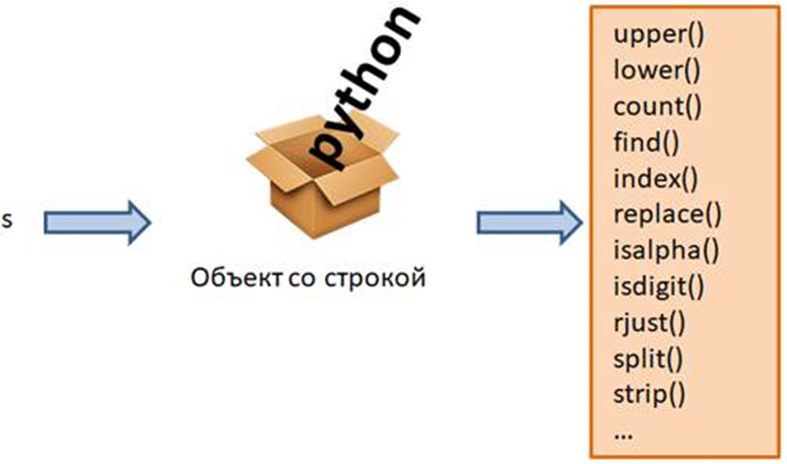
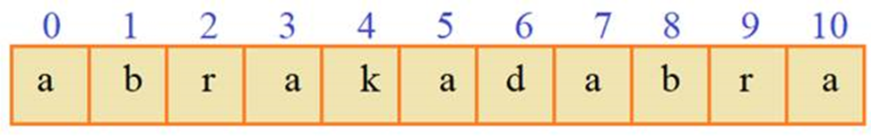

## Основные методы строк

Познакомимся с основными методами для строк. 

Что такое методы? Смотрите, когда мы объявляем какую-либо строку:

```python
s = "python"
```
то в памяти устройства автоматически создается объект, содержащий указанные символы. 
Тип данных этого объекта – строка:

```python
type(s)
```
Так вот, каждый такой объект связан с набором стандартных функций по работе со строками. 




Эти функции и называются методами


Чтобы вызвать метод для конкретной строки, необходимо указать объект, поставить точку, записать имя метода и в круглых скобках список аргументов, если они необходимы:

```python
объект.метод(аргументы)
```

Давайте рассмотрим все на конкретных примерах.
Итак, у нас есть объект-строка, на который ссылается переменная `s`. 
Через эту переменную можно вызывать все методы строк. 
Чтобы увидеть их полный список, можно записать:

```python
s
```

и Pycharm отобразит полный их список. 
Мы с вами сейчас увидим работу наиболее употребительных из них. 
Первый метод:

```python
s.upper()
```

возвращает новую строку (новый объект) со всеми заглавными буквами. 
При этом сама строка остается без изменений. 

И это логично, так как строки относятся к неизменяемым типам данных.

Обратите внимание, для вызова этого метода после его имени обязательно нужно поставить круглые скобки. 

Без них мы получим просто ссылку на объект-функцию:

```python
s.upper
```

но запущена она не будет.
Для запуска необходимы круглые скобки в конце – это оператор для выполнения функций и методов.
Если мы хотим сохранить результат преобразования строки в какой-либо переменной, то это делается так:

```python
res = s.upper()
```
И теперь `res` ссылается на строку `PYTHON`'.`
Второй метод:
```python
res.lower()
```
наоборот, переводит все буквенные символы в нижний регистр и возвращает соответствующую строку.
Следующий метод

```python
String.count(sub[, start[, end]])
```

возвращает число повторений подстроки sub в строке `String`. 

Два необязательных аргумента:
* start – индекс, с которого начинается поиск;
* end – индекс, которым заканчивается поиск.

В самом простом случае, мы можем для строки
```python
msg = "abrakadabra"
```
определить число повторений сочетаний «ra»:

```python
msg.count("ra")
```
получим значение 2 – именно столько данная подстрока встречается в нашей строке.

Теперь предположим,  что мы хотим начинать поиск с буквы k, имеющей индекс 4.




Тогда метод следует записать со значением `start=4`:
```python
msg.count("ra", 4)
```
и мы получим значение `1`. 

Далее, укажем третий аргумент – индекс, до которого будет осуществляться поиск. 
Предположим, что мы хотим дойти до 10-го индекса и записываем:

```python
msg.count("ra", 4, 10)
```
и получаем значение 0. 

Почему? 

Ведь на индексах 9 и 10 как раз идет подстрока «ra»? 

Но здесь, также как и в срезах, последний индекс исключается из рассмотрения. 

То есть, мы говорим, что нужно дойти до 10-го, не включая его. 

А вот если запишем 11:

```python
msg.count("ra", 4, 11)
```
то последнее включение найдется.

Следующий метод

```python
String.find(sub[, start[, end]])
```
возвращает индекс первого найденного вхождения подстроки sub в строке String. А аргументы start и end работают также как и в методе count. Например:
```python
msg.find("br")
```
возвращает 1, т.к. первое вхождение «br» как раз начинается с индекса ``1. 
Поставим теперь значение `start=2`:

```python
msg.find("br", 2)
```
и поиск начнется уже со второго индекса. 

Получим значение `8` – индекс следующего вхождения подстроки «br». 

Если мы укажем подстроку, которой нет в нашей строке:
```python
msg.find("brr")
```
то метод find возвращает `-1`.

Третий аргумент end определяет индекс, до которого осуществляется поиск и работает также как и в методе `count`.

Метод `find` ищет первое вхождение слева-направо. 

Если требуется делать поиск в обратном направлении: справа-налево, то для этого используется метод
```python
String.rfind(sub[, start[, end]])
```
который во всем остальном работает аналогично `find`. 

Например:
```
msg.rfind("br")
```
возвратит 8 – первое вхождение справа.
Наконец, третий метод, аналогичный find – это:
```
String.index(sub[, start[, end]])
```
Он работает абсолютно также как find, но с одним отличием: если указанная подстрока sub не находится в строке String, то метод приводит к ошибке:
```
msg.index("brr")
```
тогда как find возвращает -1. 

Спрашивается: зачем нужен такой ущербный метод index? 

В действительности такие ошибки можно обрабатывать как исключения и это бывает полезно для сохранения архитектуры программы, когда неожиданные ситуации обрабатываются единым образом в блоке исключений. 

Но, обо всем этом позже.
Следующий метод
```
String.replace(old, new, count=-1)
```
Выполняет замену подстрок old на строку new и возвращает измененную строку. Например, в нашей строке, мы можем заменить все буквы a на o:

> msg.replace("a", 'o')

на выходе получим строку «obrokodobro». Или, так:
> msg.replace("ab", "AB")
Используя этот метод, можно выполнять удаление заданных фрагментов, например, так:
> msg.replace("ab", "")

Третий необязательный аргумент задает максимальное количество замен. 

Например:
> msg.replace("a", 'o', 2)

Заменит только первые две буквы `a`:

 `«msg.replace("a", 'o', 2)»`. 

При значении `-1` количество замен неограниченно.
Следующие методы позволяют определить, из каких символов состоит наша строка.

 Например, метод
 ```
String.isalpha()
```
возвращает True, если строка целиком состоит из букв и False в противном случае.

 Посмотрим, как он работает:
``` 
msg.isalpha()
```

вернет `True`, т.к. наша строка содержит только буквенные символы. 

А вот для такой строки:
```
"hello world".isalpha()
```
мы получим `False`, т.к. имеется символ пробела.

Похожий метод
```
String.isdigit()
```

возвращает `True`, если строка целиком состоит из цифр и `False` в противном случае. 

Например:
```
"5.6".isdigit()
```
т.к. имеется символ точки, а вот так:
```
"56".isdigit()
```
получим значение `True`. 

Такая проверка полезна, например, перед преобразованием строки в целое число. О проверках мы еще будем говорить.
Следующий метод
```
String.rjust(width[, fillchar = ‘ ‘])
```
возвращает новую строку с заданным числом символов width и при необходимости слева добавляет символы fillchar:
d="abc"
d.rjust(5)
Получаем строку «  abc» с двумя добавленными слева пробелами. А сама исходная строка как бы прижимается к правому краю. Этот метод часто используют для добавления незначащих нулей перед цифрами:
```
d = "12"
d.rjust(3, '0')
```
Получим строку «012». 

Причем вторым аргументом можно писать только один символ. Если записать несколько, то возникнет ошибка:
d.rjust(3, "00")
Если ширина width будет меньше длины строки:
d.rjust(1)
то вернется исходная строка. Аналогично работает метод
String.ljust(width[, fillchar = ‘ ‘])
который возвращает новую строку с заданным числом символов width, но добавляет символы fillchar уже справа:
d.ljust(10, "*")
Следующий метод
String.split(sep=None, maxsplit=-1)
возвращает коллекцию строк, на которые разбивается исходная строка String. Разбивка осуществляется по указанному сепаратору sep. Например:
"Иванов Иван Иванович".split(" ")
Мы здесь разбиваем строку по пробелам. Получаем коллекцию из ФИО. Тот же результат будет и при вызове метода без аргументов, то есть, по умолчанию он разбивает строку по пробелам:
"Иванов Иван Иванович".split()
А теперь предположим, перед нами такая задача: получить список цифр, которые записаны через запятую. Причем, после запятой может быть пробел, а может и не быть. Программу можно реализовать так:
digs = "1, 2,3, 4,5,6"
digs.replace(" ", "").split(",")
мы сначала убираем все пробелы и для полученной строки вызываем split, получаем список цифр.
split(delimeter, num): параметр num указывает, сколько вхождений delimeter используется для разделения. Оставшаяся часть строки добавляется в список без разделения на подстроки.
text = "Это был огромный, в два обхвата дуб, с обломанными ветвями и с обломанной корой"
# разбиение по первым пяти пробелам
splitted_text = text.split(" ", 5)
print(splitted_text)        
print(splitted_text[5])     # обхвата дуб, с обломанными ветвями и с обломанной корой

Еще один метод - partition() разбивает строку по разделителю на три подстроки и возвращает кортеж из трех элементов - подстрока до разделителя, разделитель и подстрока после разделителя:
text = "Это был огромный, в два обхвата дуб, с обломанными ветвями и с обломанной корой"
text_parts = text.partition("дуб")
print(text_parts)
# ('Это был огромный, в два обхвата ', 'дуб', ', с обломанными ветвями и с обломанной корой')


Обратный метод
String.join(список)
возвращает строку из объединенных элементов списка, между которыми будет разделитель String. Например:
d = digs.replace(" ", "").split(",")
", ".join(d)
получаем строку «1, 2, 3, 4, 5, 6». Или так, изначально была строка:
fio = "Иванов Иван Иванович"
и мы хотим здесь вместо пробелов поставить запятые:
fio2 = ",".join(fio.split())
Теперь fio2 ссылается на строку с запятыми «Иванов,Иван,Иванович».
Вместо списка в метод join можно передать простую строку, тогда разделитель будет вставляться между символами этой строки:
word = "hello"
joined_word = "|".join(word)
print(joined_word)      # h|e|l|l|o

Следующий метод
String.strip()
удаляет пробелы и переносы строк в начале и конце строки. Например:
"    hello world         \n".strip()
возвращает строку «hello world». Аналогичные методы:
String.rtrip() и String.ltrip()
удаляют пробелы и переносы строк только справа или только слева.
Метод isalpha() возвращает True, если все символы в строке являются алфавитными. Если нет, возвращается False.
str.isalnum()
Возвращает значение True, если все символы в строке являются буквенно-цифровыми и имеется хотя бы один символ, False в противном случае. Символ является буквенно-цифровым, если возвращается одно из следующих значений True: c.isalpha(), c.isdecimal(), c.isdigit(), или c.isnumeric().
str.isascii()
Возврат, True если строка пуста или все символы в ней являются ASCII, False в противном случае. Символы ASCII имеют кодовые точки в диапазоне от U+0000 до U+007F.

Подстановки
Еще один способ передачи форматируемых значений в строку представляет использование подстановок или специальных плейсхолдеров, на место которых вставляются определенные значения. Для форматирования мы можем использовать следующие плейсхолдеры:
•	s: для вставки строк
•	d: для вставки целых чисел
•	f: для вставки дробных чисел. Для этого типа также можно определить через точку количество знаков в дробной части.
•	%: умножает значение на 100 и добавляет знак процента

1
2
3	n = 5000
source = f"{n:,d} символов"
print(source)   # 5,000 символов


Для дробных чисел, то есть таких, которые представляют тип float, перед кодом плейсхолдера после точки можно указать, сколько знаков в дробной части мы хотим вывести:
```
number = 23.8589578
print("{:.2f}".format(number))   # 23.86
print("{:.3f}".format(number))   # 23.859
print("{:.4f}".format(number))   # 23.8590
print("{:,.2f}".format(10001.23554))    # 10,001.24
```
Еще один параметр позволяет установить минимальную ширину форматируемого значения в символах:
```
print("{:10.2f}".format(23.8589578))    #     23.86
print("{:8d}".format(25))               #      25
```
Аналогичный пример с f-строками:
1
2
3
4	n1 = 23.8589578
print(f"{n1:10.2f}")    #     23.86
n2 = 25
print(f"{n2:8d}")       #      25
Для вывода процентов лучше воспользоваться кодом "%":
1
2
3
4
5
6
7
8	number = .12345
print("{:%}".format(number))        # 12.345000%
print("{:.0%}".format(number))      # 12%
print("{:.1%}".format(number))      # 12.3%
 
print(f"{number:%}")        # 12.345000%
print(f"{number:.0%}")      # 12%
print(f"{number:.1%}")      # 12.3%

В заключение занятия я приведу список всех рассмотренных методов, которые хорошо было бы запомнить и применять по мере необходимости при работе со строками:
