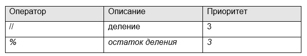

## Дополнительная математические операции




Если же нам нужно выполнить деление с округлением к наименьшему целому, то это делается через оператор:

> d3 = 7 // 2

На выходе получаем значение 3, так как оно является наименьшим целым по отношению к `3,5`. 

Обратите внимание, что при делении отрицательных чисел:

> d3 = -7 // 2

получим уже значение -4, так как оно наименьшее по отношению к -3,5. Вот этот момент следует иметь в виду, применяя данный оператор деления.

Следующий оператор умножения работает очевидным образом:
```
5 * 6
2 * 4.5
```

Обратите внимание, в последней операции получим вещественное значение 9.0, а не целое 9, так как при умножении целого на вещественное получается вещественное число.

Давайте теперь предположим, что мы хотим вычислить целый остаток от деления. 

Что это вообще такое? Например, если делить

```
10 : 3
```

то остаток будет равен 1. 
Почему так? 

Все просто, число 3 трижды входит в число 10 и остается значение 10 - 3∙3 = 1. 

Для вычисления этого значения в Python используется оператор:
```
10 % 3
```
Если взять:
```
10 % 4
```

то получим 2.
Я думаю, общий принцип понятен. 
Здесь есть только один нюанс, при использовании отрицательных чисел.

Давайте рассмотрим четыре возможные ситуации:

```python
9 % 5   # значение 4 (9 - 5)
-9 % 5  # значение 1 (-9 – (-10) = 1)
9 % -5  # значение -1 (9 – 10 = -1)
-9 % -5 # значение -4 (-9 – (-5) = -4)
```
Почему получаются такие значения?
Первое, я думаю, понятно. 

Здесь 5 один раз входит в 9 и остается еще 4.

При вычислении `-9 % 5` по правилам математики следует взять наименьшее целое, делящееся на 5. 

Здесь – это значение -10. 

А, далее, как и прежде, вычисляем разность между наименьшим, кратным `5 и -9`:

> -9 – (-10) = 1

При вычислении 9 % -5, когда делитель отрицательное число, следует выбирать наибольшее целое, кратное 5. 

Это значение 10. 

А, далее, также вычисляется разность:

> 9 – 10 = -1

В последнем варианте -9 % -5 следует снова выбирать наибольшее целое (так как делитель отрицателен), получаем -5, а затем, вычислить разность:

> -9 – (-5) = -4

Как видите, в целом, все просто, только нужно запомнить и знать эти правила. Кстати, они вам в дальнейшем пригодятся на курсе математики.

> divmod(9,5) -

принимает два любых числа (за исключением комплексных чисел) и возвращает кортеж(!) состоящий из двух элементов.

### Приоритеты арифметических операций

Давайте теперь посмотрим, что будет, если выполнить команду:

> 27 ** 1/3

Получим значение `9`. 

Почему так произошло? 

Ведь кубический корень из 27 – это 3, а не 9? 

Все дело в приоритете арифметических операций (проще говоря, в последовательности их выполнения). 

Приоритет у оператора возведения в степень ** - наибольший. 

Поэтому здесь сначала 27 возводится в степень 1, а затем, 27 делится на 3. 

Получаем искомое значение 9.

Если нам нужно изменить порядок вычисления, то есть, приоритеты, то следует использовать круглые скобки:

> 27 ** (1/3)

Теперь видим значение `3`. 

То есть, по правилам математики, сначала производятся вычисления в круглых скобках, а затем, все остальное в порядке приоритетов.

Приведу еще один пример, чтобы все было понятно:
```python 
2 + 3 * 5    # 17
(2 + 3) * 5  # 25
```

То есть, приоритеты работают так, как нас учили на школьных уроках математики.

Я думаю, здесь все должно быть понятно. 
Также не забывайте, что все арифметические операторы выполняются слева-направо (кроме оператора возведения в степень), поэтому в строчке:

> 32 / 4 * 2

сначала будет выполнено деление на 4, а затем, результат умножается на 2.


```python

x = 2.5
print(x.as_integer_ratio()) # что делает эта операция
```


```python

x = -2.5
print(abs(x)) # что делает эта операция
```


```python

x = -1/3
print(round(x,5)) # что делает эта операция
print(round(x,2)) # что делает эта операция
print(round(78756, -3)) # что делает эта операция
```


## Дополнительные арифметические операторы (syntax sugar)

В заключение этого рассмотрим некоторые дополнения к арифметическим операторам.

Предположим, что у нас имеются переменные:
```python
i = 5
j = 3
```
И, далее, мы хотим переменную i увеличить на 1, а j – уменьшить на 2. Используя существующие знания, это можно сделать, следующим образом:

```python
i = i + 1
j = j - 2
print(i, j)
```

Но можно проще, используя операторы:
```python
i += 1
j -= 2
```

Результат будет прежним, но запись короче. 

Часто, в таких ситуациях на практике используют именно такие сокращенные операторы.
То же самое можно делать и с умножением, делением:
```python
i *= 3
j /= 4
print(i, j)
```

и другими арифметическими операторами.
```python
+= # Присвоение результата сложения
-= # Присвоение результата вычитания
*= # Присвоение результата умножения
/= # Присвоение результата от деления
//= # Присвоение результата целочисленного деления
**= # Присвоение степени числа
%= # Присвоение остатка от деления
```
Надеюсь, вам были понятны действия с арифметическими операторами. 

