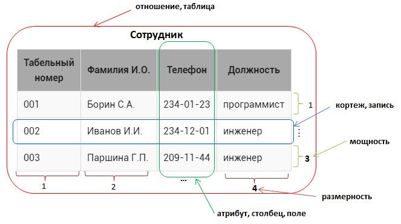
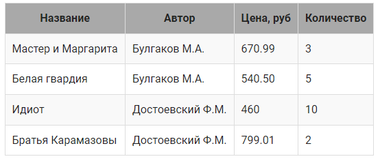
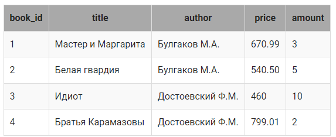

## Основные понятия реляционных баз данных

Реляционная модель была разработана в конце 1960-х годов Е.Ф.Коддом .

 Она определяет способ представления данных (структуру данных), методы защиты данных (целостность данных), и операции, которые можно выполнять с данными (манипулирование данными). 
 
 Эта модель лежит в основе всех реляционных баз данных до настоящего времени.

## Основные принципы реляционных баз данных:

все данные на концептуальном уровне представляются в виде объектов, заданных в виде строк и столбцов, называемых отношением, более распространенное название – таблица;
в пересечение строки и столбца таблицы можно занести только одно значение;
все операции выполняются над целыми отношениями и результатом этих операций является отношение.

Пример отношения: 

На примере таблицы `Сотрудник` рассмотрим терминологию реляционных баз данных:

* отношение  – это структура данных целиком, набор записей (в обычном понимании – таблица) , в  примере –это Сотрудник;

* кортеж – это каждая строка , содержащая данные (более распространенный термин – запись ), например, <001, Борин С.А, 234-01-23, программист>, все кортежи в отношении должны быть различны;

* мощность – число кортежей в таблице (проще говоря, число записей), в данном случае 3, мощность отношения может быть любой (от 0 до бесконечности), порядок следования кортежей - неважен;

* атрибут – это столбец в таблице (более распространенный термин – поле ), в примере – Табельный номер, Фамилия И.О., Телефон, Должность) 

* размерность – это число атрибутов в таблице, в данном случае – 4;

* размерность отношения должна быть больше 0, порядок следования атрибутов существенен;

*  домен атрибута – это допустимые значения (неповторяющиеся), которые можно занести в поле , например для атрибута Должность домен – {инженер, программист}.

## Отношение, реляционная модель

База данных, в том числе и реляционная, используется для формального описания  некоторой предметной области реального мира, например, склада, учебного процесса и пр. Обязательным этапом перед созданием базы данных является ее проектирование (этот процесс разбирается в следующих модулях).

В первом модуле будем рассматривать простейшие предметные области, информацию о которых можно описать в виде одной таблицы. Каждая такая таблица ассоциируется с неким информационным объектом или событием реального мира – человеком, документом, посещением и т.д. 

## Пример.

Рассмотрим некоторый склад, на котором хранятся книги. Известно название книги, ее автор, количество экземпляров на складе и ее цена.

Всю эту информацию можно представить в виде таблицы, состоящей из 4 столбцов (приведено только 4 записи, на самом деле их значительно больше):

Перед созданием таблицы в базе данных необходимо описать ее структуру.

Для этого выполняется следующая последовательность шагов:

> 1. Дать таблице имя, пусть она будет называться book, вот некоторые правила для выбора имен таблиц:

может включать латинские буквы, цифры и знак подчеркивания, должно начинаться с буквы;
имя должно быть уникальным в пределах базы данных.
Также рекомендуется:

* чтобы имя было существительным в единственном числе;
* имя должно быть понятным и соответствовать тому объекту, который оно описывает;
* имя должно быть как можно короче, максимум до 10 символов.

## Важно. 
Имена таблиц являются часто регистрозависимыми из-за операционной системы, то есть имя book и Book – разные имена. 
Рекомендуется для записи имен таблиц использовать только строчные (маленькие) буквы.

> 2. Определить структуру таблицы, из каких атрибутов(столбцов, полей) она будет состоять,  в нашем случае это:

* title – поле для хранения названия книги;
* author – поле с фамилией автора книги ;
* priсe – цена книги;
* amount – количество книг.

> Правила по выбору имени поля информационного объекта:

* может включать латинские буквы, цифры и знак подчеркивания, должно начинаться с буквы;
* имя поля должно быть уникальным в пределах таблицы.

> Рекомендации по выбору имени поля информационного объекта:

* имя должно быть понятным и соответствовать тем данным, которые хранятся в поле;

* имя может состоять из нескольких слов, тогда слова разделяются подчеркиванием, после подчеркивания слово пишется с маленькой буквы.

> 3. Включить ключевое поле `book_id`, которое является `ОБЯЗАТЕЛЬНЫМ ЭЛЕМЕНТОМ` каждой реляционной таблицы. 

Ключевое поле является уникальным для каждой записи, однозначно определяет запись и в дальнейшем будет использоваться для связей с другими таблицами.

Рекомендации по именованию  ключевых полей:

* имя должно состоять  из двух частей: начинаться с названия таблицы, которой поле принадлежит,   затем через подчеркивание необходимо указать id.

Таким образом, наша таблица `book` будет выглядеть следующим образом:

