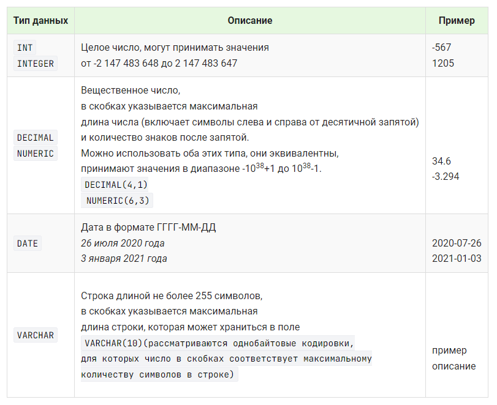

# Выбор типов данных для полей 

После описания структуры таблицы необходимо выбрать типы данных для каждого поля.

Основные типы данных SQL:

> Рекомендации по выбору типов данных для полей таблицы.

Выбирайте минимальный тип данных исходя из максимального значения поля. 

Например, если максимальный текст, который может быть записан в поле, имеет длину `25 символов`, значит нужно использовать тип `VARCHAR(25)`.

Для описания ключевого поля используйте описание `INT PRIMARY KEY AUTO_INCREMENT`. 

Это значит, что в поле будут заноситься различные целые числа, при этом они будут автоматически генерироваться (каждая следующая строка будет иметь значение ключа на 1 больше предыдущего).

Определим тип данных для каждого поля таблицы `book`:

* book_id - ключевой столбец, целое число, которое должно генерироваться автоматически  - INT PRIMARY KEY AUTO_INCREMENT;

* title - строка текста, ее длина выбирается в зависимости от данных, которые предполагается хранить в поле, предположим, что название книги не превышает 50 символов - VARCHAR(50);

* author - строка текста - VARCHAR(30);

* priсe - для описание денежного значения используется числовой тип данных с двумя знаками после запятой - DECIMAL(8,2);

* amount - целое число - INT