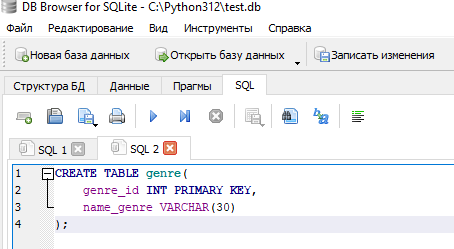
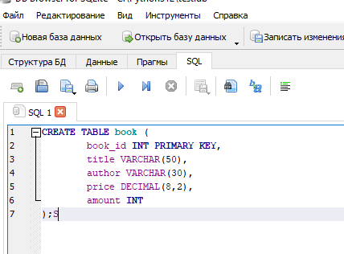

### Создание таблицы

Для создания таблицы используется SQL-запрос. 

В нем указывается какая таблица создается, из каких атрибутов(полей) она состоит и какой тип данных имеет каждое поле, при необходимости указывается описание полей (ключевое поле и т.д.). 

Его структура :

* ключевые слова : CREATE TABLE
* имя создаваемой таблицы;
* открывающая круглая скобка «(»;
* название поля и его описание, которое включает тип поля и другие необязательные характеристики;
запятая;
* название поля и его описание;
...
* закрывающая скобка «)».


Пример sql-запроса по созданию таблицы



Пример 



```sql
CREATE TABLE book (
        book_id INT PRIMARY KEY, 
        title VARCHAR(50), 
        author VARCHAR(30), 
        price DECIMAL(8,2), 
        amount INT
);
```