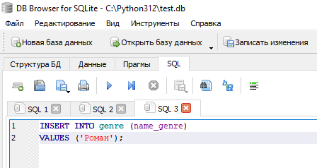
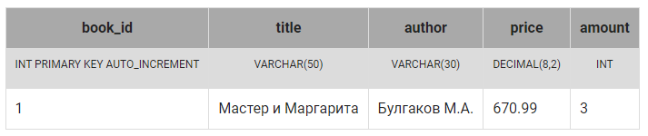
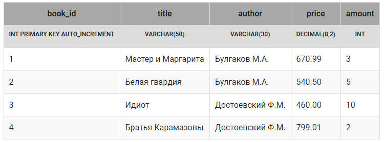

## Вставка записи в таблицу

Для занесения новой записи в таблицу используется SQL запрос, в котором указывается в какую таблицу, в какие поля заносить новые значения. 

> Структура запроса:

* ключевые слова INSERT INTO (ключевое слово INTO можно пропустить);

* имя таблицы, в которую добавляется запись;
* открывающая круглая скобка «(»;
*  список полей через запятую, в которые следует занести новые данные;
* закрывающая скобка «)»;
* ключевое слово VALUES;
* открывающая круглая скобка «(»;
* список значений через запятую, которые заносятся в соответствующие поля, при этом текстовые значения заключаются в кавычки, числовые значения записываются без кавычек, в качестве разделителя целой и дробной части используется точка;
* закрывающая скобка «)».

> Пример. В таблицу, состоящую из двух столбцов добавим новую строку, при этом в поле1 заносится значение1,  в поле2 - значение2.

```sql
INSERT INTO таблица(поле1, поле2) 
VALUES (значение1, значение2);
```

В результате выполнения запроса новая запись заносится в конец обновляемой таблицы.

При составлении списка полей и списка значений необходимо учитывать следующее:

* количество полей и количество значений в списках должны совпадать;

* должно существовать прямое соответствие между позицией одного и того же элемента в обоих списках, поэтому первый элемент списка значений должен относиться к первому столбцу в списке столбцов, второй – ко второму столбцу и т.д.;

*  типы данных элементов в списке значений должны быть совместимы с типами данных соответствующих столбцов таблицы ( целое число можно занести в поле типа DECIMAL, обратная операция - недопустима);

* новые значения нельзя добавлять в поля, описанные как PRIMARY KEY AUTO_INCREMENT;

* рекомендуется заполнять все поля записи, если же поле пропущено, значение этого поля зависит от установленных по умолчанию значений, если значения не установлены - на данной платформе вставляется пустое значение (NULL).

Пример

Вставим новую запись в таблицу genre, созданную на предыдущем шаге ( в первых двух строках показана структура таблицы, далее - ее содержимое):



Чтобы увидеть как именно выглядит таблица genre, можно добавить SQL запрос, который выберет все записи из таблицы:


```sql
SELECT * FROM genre;
```

## Задание 1

Занесите новую строку в таблицу book (текстовые значения (тип VARCHAR) заключать либо в двойные, либо в одинарные кавычки):



## Задание 2


Занесите три последние записи в таблицу `book`,  первая запись уже добавлена на предыдущем шаге:

