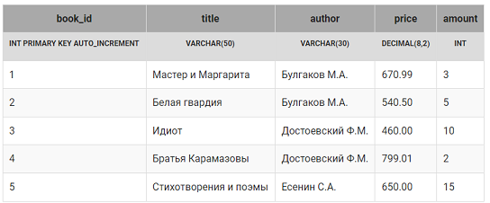
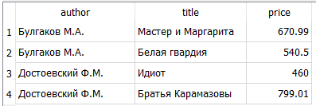
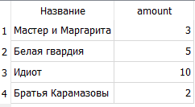
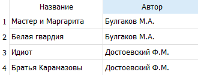
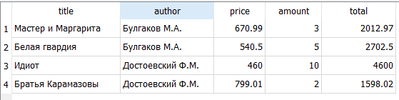
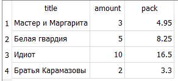

> В этом разделе будет рассмотрен синтаксис и семантика следующих SQL запросов: 

* выборка всех данных из таблицы; 
* выборка данных из отдельных столбцов; 
* присвоение новых имен столбцам при формировании выборки; 
* создание вычисляемых столбцов; 
* вычисляемые столбцы, математические функции; 
* вычисляемые столбцы, логические функции; 
* выборка данных по простому условию; 
* выборка данных с использованием логических выражений и операций; 
* выборка данных, операторы BETWEEN, IN; 
* выборка данных с сортировкой;
* выборка текстовых данных по шаблону, оператор LIKE. 

## Структура и наполнение таблицы

Все запросы будут формулироваться для таблицы book(создание, заполнение):




## Выборка всех данных из таблицы

Для того чтобы отобрать все данные из таблицы используется SQL запрос следующей структуры: 

* ключевое слово SELECT; 
* символ « *» ; 
* ключевое слово FROM; 
* имя таблицы.

Результатом является таблица, в которую включены все строки и столбцы указанной в запросе таблицы.

> Пример

Выбрать все записи таблицы book .

Запрос:
```sql
SELECT * FROM book;
```

## Задание
Вывести информацию о всех книгах, хранящихся на складе.

## Выборка отдельных столбцов
Для того чтобы отобрать данные из определенных столбцов таблицы используется SQL запрос следующей структуры: 

* ключевое слово SELECT ; 
* список столбцов таблицы через запятую; 
* ключевое слово FROM ; 
* имя таблицы.

Результатом является таблица, в которую включены все данные из указанных после SELECT столбцов исходной таблицы.

Пример

Выбрать названия книг и их количества из таблицы book .

Запрос:
```sql
SELECT title, amount FROM book;
```


> Задание
Выбрать авторов, название книг и их цену из таблицы `book`.




## Присвоение новых имен столбцам при формировании выборки

Для того чтобы отобрать данные из определенных столбцов таблицы и одновременно задать столбцам новые названия в результате выборки используется `SQL` запрос следующей структуры: 

* ключевое слово SELECT ; 
* имя столбца;
* ключевое слово AS ; 
* новое название столбца (можно русскими буквами), выводимое в результате запроса, но это должно быть одно слово, если название состоит из двух слов – соединяйте их подчеркиванием, например, Количество_книг; 
запятая; 
* имя столбца; 
* .... ;
* ключевое слово FROM ; 
* имя таблицы.

В одном запросе можно использовать и `имена столбцов` из таблицы, и `новые названия`.

Результатом является таблица, в которую включены все данные из указанных после `SELECT` столбцов исходной таблицы. 

Каждому столбцу в результате запроса присваивается новое имя, заданное после `AS`, или столбец получает имя столбца исходной таблицы, если `AS` отсутствует.

> Пример

Выбрать все названия книг и их количества из таблицы `book` , для столбца `title` задать новое имя `Название`.

Запрос:

```sql
SELECT title AS Название, amount 
FROM book;
```

Результат:




> Задание
Выбрать названия книг и авторов из таблицы book, для поля `title` задать имя(псевдоним) `Название`, для поля `author` –  `Автор`. 

Результат:




## Выборка данных с созданием вычисляемого столбца

С помощью `SQL` запросов можно осуществлять вычисления по каждой строке таблицы с помощью вычисляемого столбца. 

Для него в списке полей после оператора `SELECT` указывается выражение и задается имя.

Выражение может включать имена столбцов, константы, знаки операций, встроенные функции.

Результатом является таблица, в которую включены все данные из указанных после `SELECT` столбцов, а также новый столбец, в каждой строке которого вычисляется заданное выражение.

* Пояснение 

Можно осуществлять арифметические и логические вычисления над целым столбцом, результатом будет новый столбец.

Пример

Вывести всю информацию о книгах, а также для каждой позиции посчитать ее стоимость (произведение цены на количество). Вычисляемому столбцу дать имя `total` .

Запрос:
```sql    
SELECT title, author, price, amount, 
     price * amount AS total 
FROM book;
```
Результат:




> Задание

Для упаковки каждой книги требуется один лист бумаги, цена которого 1 рубль 65 копеек. 

Посчитать стоимость упаковки для каждой книги (сколько денег потребуется, чтобы упаковать все экземпляры книги). 

В запросе вывести название книги, ее количество и стоимость упаковки, последний столбец назвать `pack`. 


