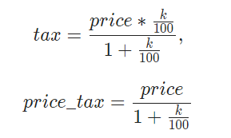

Выборка данных, вычисляемые столбцы, математические функции

В `SQL` реализовано множество  математических функций для работы с числовыми данными. 

В таблице приведены некоторые из них.


Существуют разные способы округления чисел.

В `SQL` реализовано математическое округление. 

Для округления вещественного числа нужно в записи числа выбрать разряд в дробной части, до которого производится округление. 

Цифра, записанная в выбранном разряде: не меняется, если следующая за ней справа цифра - 0, 1, 2, 3 или 4; увеличивается на единицу, если следующая за ней справа цифра - 5,6,7,8 или 9.

> Пример 

Для каждой книги из таблицы `book` вычислим налог на добавленную стоимость (имя столбца `tax`) , который включен в цену и составляет `k = 18%`,  а также цену книги (`price_tax`) без него. 

Формулы для вычисления:



Значение НДС в 18% взято для ПРИМЕРА, чтобы показать как использовать функции округления.

Эта формула НДС отвечает на вопрос "Какую сумму увеличили на 18%, чтобы получить текущее значение"

```sql
SELECT title, price, 
    (price * 18 / 100) / (1 + 18 / 100) AS tax, 
    price/(1 + 18 / 100) AS price_tax 
FROM book;

```

> Результат:


Сумма налога и цена книги без налога – это деньги, поэтому количество знаков после запятой у этих чисел должно быть 2. 

Следовательно необходимо округлить полученные значения.

```sql
SELECT title, 
    price, 
    ROUND((price * 18 / 100)/(1 + 18 / 100), 2) AS tax, 
    ROUND(price / (1 + 18 / 100), 2) AS price_tax 
FROM book;
```


# Задание

В конце года цену каждой книги на складе пересчитывают – снижают ее на `30%`. 

Написать `SQL` запрос, который из таблицы `book` выбирает названия, авторов, количества и вычисляет новые цены книг. 

Столбец с новой ценой назвать `new_price`, цену округлить до `2-х` знаков после запятой.


## Выборка данных, вычисляемые столбцы, логические функции

В `SQL` реализована возможность заносить в поле значение в зависимости от условия. 

Для этого используется функция `IF()`:

> IF(логическое_выражение, выражение_1, выражение_2)

Функция вычисляет логическое_выражение, если оно истина – в поле заносится значение выражения_1, в противном случае –  значение выражения_2. 

Все три параметра IF() являются обязательными.

Допускается использование вложенных функций, вместо выражения_1 или выражения_2 может стоять новая функция IF.

> Пример 

Для каждой книги из таблицы `book` установим скидку следующим образом: если количество книг меньше `4`, то скидка будет составлять `50%` от цены, в противном случае `30%`.

Запрос:
```sql
SELECT title, amount, price, 
    IF(amount<4, price*0.5, price*0.7) AS sale
FROM book;
```
> Результат:


> Пример

Усложним вычисление скидки в зависимости от количества книг. 

Если количество книг меньше 4 – то скидка `50%`, меньше 11 – `30%`, в остальных случаях – `10%`. 

И еще укажем какая именно скидка на каждую книгу.

Запрос:

```sql
SELECT title, amount, price,
    ROUND(IF(amount < 4, price * 0.5, IF(amount < 11, price * 0.7, price * 0.9)), 2) AS sale,
    IF(amount < 4, 'скидка 50%', IF(amount < 11, 'скидка 30%', 'скидка 10%')) AS Ваша_скидка
FROM book;
```


Результат:


## Задание

При анализе продаж книг выяснилось, что наибольшей популярностью пользуются книги `Михаила Булгакова`, на втором месте книги `Сергея Есенина`. 

Исходя из этого решили поднять цену книг `Булгакова` на `10%`, а цену книг `Есенина` - на `5%`. 

Написать запрос, куда включить `автора`, `название книги` и новую `цену`, `последний столбец` назвать `new_price`. 

Значение округлить до двух знаков после запятой.

> Пояснение

* фамилию автора задавать с инициалами (как занесено в таблице), заключая в одинарные или двойные кавычки;
* для сравнения на равенство использовать знак `=`, например `author = "Булгаков М.А."`.


> Результат

