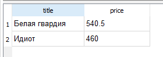
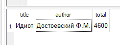
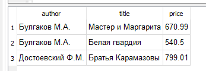

## Выборка данных по условию


С помощью запросов можно включать в итоговую выборку не все строки исходной таблицы, а только те, которые отвечают некоторому условию.

Для этого после указания таблицы, откуда выбираются данные, задается ключевое слово `WHERE` и логическое выражение, от результата которого зависит будет ли включена строка в выборку или нет. 

Если условие – `истина`, то строка(запись)  включается в выборку, если `ложь` – нет.

Логическое выражение может включать операторы сравнения (равно «=», не равно «<>», больше «>», меньше «<», больше или равно«>=», меньше или равно «<=») и выражения, допустимые в SQL.

### 3Пример

Вывести название и цену тех книг, цены которых меньше 600 рублей.

Запрос:

```sql
SELECT title, price 
FROM book
WHERE price < 600;
```


Результат:




## Пример

Вывести название, автора  и стоимость (цена умножить на количество) тех книг, стоимость которых больше 4000 рублей

Запрос:
```sql
SELECT title, author, price * amount AS total
FROM book
WHERE price * amount > 4000;

```
Результат:



## Задание
Вывести автора, название  и цены тех книг, количество которых меньше 10.

Результат:


