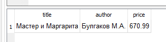
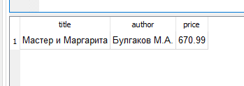
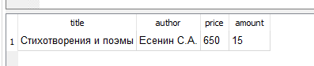

## Выборка данных, логические операции

Логическое выражение после ключевого слова `WHERE` кроме операторов сравнения  и выражений может включать  логические операции (И «and», ИЛИ «or», НЕ «not») и круглые скобки, изменяющие приоритеты выполнения операций.

Приоритеты операций:

* круглые скобки
* умножение  (*),  деление (/)
* сложение  (+), вычитание (-)
* операторы сравнения (=, >, <, >=, <=, <>)
* NOT
* AND
* OR

### Пример

> Вывести название, автора и цену тех книг, которые написал Булгаков, ценой больше 600 рублей

> Запрос:

```sql
SELECT title, author, price 
FROM book
WHERE price > 600 AND author = 'Булгаков М.А.';
```

> Результат:




** Пример

Вывести название, цену  тех книг, которые написал Булгаков или Есенин, ценой больше 600 рублей

> Запрос:

```sql
SELECT title, author, price 
FROM book
WHERE (author = 'Булгаков М.А.' OR author = 'Есенин С.А.') AND price > 600;
```

> Результат:




### Задание

Вывести название, автора,  цену  и количество всех книг, цена которых меньше `500` или больше `600`, а стоимость всех экземпляров этих книг больше или равна `5000`.


