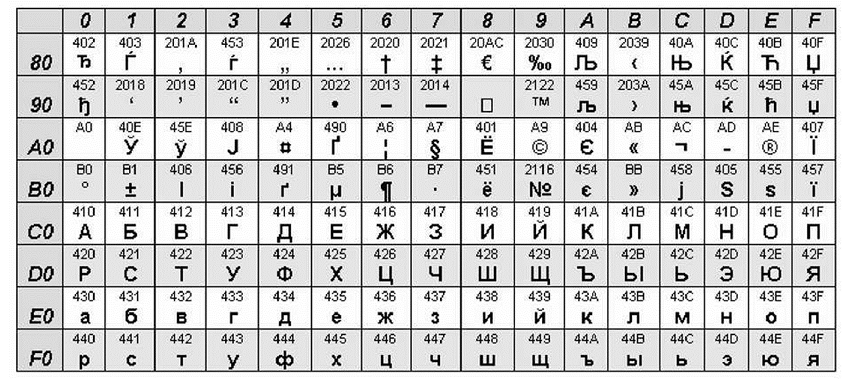
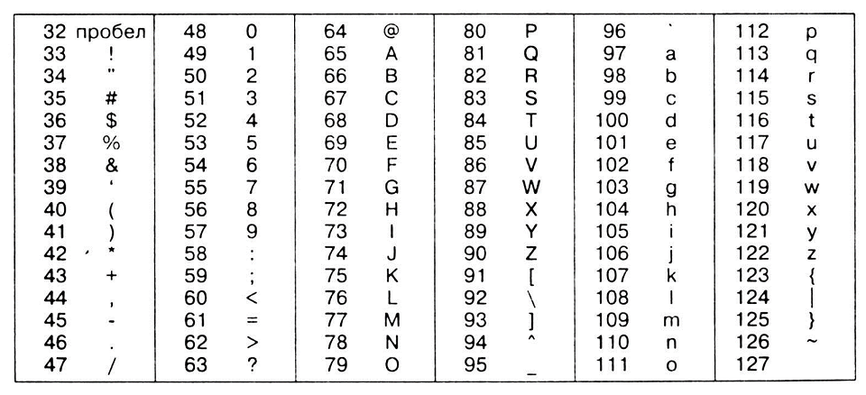
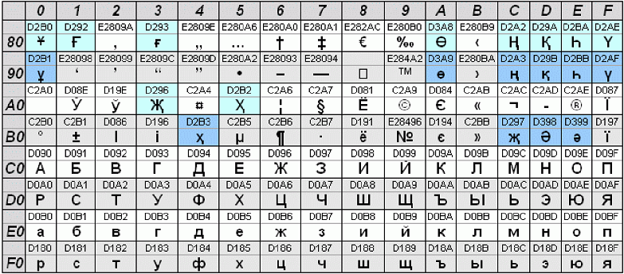

# Модуль 3. Последовательности и циклы

### 1 Индекс и срезы

```python
s = "hello python"
s[0]
s[1]
len(s) - 1

строка[start:stop)
s[1:3]
s[2:-2]
```

### Изменение строк

```python
s[0] = 'H'
s2 = 'H' + s[1:]

```


* строка – упорядоченный набор символов;
* как выполняется индексация к отдельным символам строки str[index];
* как выделять из строк наборы символов – срезы;
* строка – неизменяемый объект;
* способ модификации (изменения) строк через индексы и срезы.

## [Практика](/module-3/1_practice.md)


### Методы строк

```python
x = 0.25
y = -0.25
print("\nOriginal Number: ", x)
print(f'{x:.2%}') # print(f'{x = :.2%}')
print("Formatted Number with percentage: "+"{:.2%}".format(x));
print("Original Number: ", y)
print("Formatted Number with percentage: "+"{:.2%}".format(y));
```


```python
s = "python"
```


```python
объект.метод(аргументы)
s.upper()
s.lower()
s.capitalize()
String.count(sub[, start[, end]])
String.find(sub[, start[, end]])
String.rfind(sub[, start[, end]])
String.index(sub[, start[, end]]) 
# Он работает абсолютно также как find, но с одним отличием: 
# если указанная подстрока sub не находится в строке String, то метод приводит к ошибке

String.replace(old, new, count=-1)
msg.replace("a", 'o', 2)
String.isalpha()
String.isdigit()
String.rjust(width[, fillchar = ‘ ‘])
String.ljust(width[, fillchar = ‘ ‘])
String.split(sep=None, maxsplit=-1)
"Иванов Иван Иванович".split(" ")
digs = "1, 2,3, 4,5,6"
digs.replace(" ", "").split(",")
text = "Это был огромный, в два обхвата дуб, с обломанными ветвями и с обломанной корой"
text_parts = text.partition("дуб")
print(text_parts)
# ('Это был огромный, в два обхвата ', 'дуб', ', с обломанными ветвями и с обломанной корой')
d = digs.replace(" ", "").split(",")
", ".join(d)
fio = "Иванов Иван Иванович"
fio2 = ",".join(fio.split())
```

Вместо списка в метод `join` можно передать простую строку, тогда разделитель будет вставляться между символами этой строки:

```python
word = "hello"
joined_word = "|".join(word)
print(joined_word)      # h|e|l|l|o
```

`String.strip()`

удаляет пробелы и переносы строк в начале и конце строки. Например:
```python
"    hello world         \n".strip()
```

возвращает строку `hello world`
Аналогичные методы:

`String.rtrip() и String.ltrip()`

удаляют пробелы и переносы строк только справа или только слева.
Метод `isalpha()` возвращает `True`, если все символы в строке являются алфавитными. 
Если нет, возвращается `False`.

```python
str.isalnum()

str.isascii()
```
Возврат, `True` если строка пуста или все символы в ней являются `ASCII, False` в противном случае. 
Символы `ASCII` имеют кодовые точки в диапазоне от `U+0000 до U+007F`.


* String.upper()	Возвращает строку с заглавными буквами
* String.lower()	Возвращает строку с малыми буквами
* String.count(sub[, start[, end]])	Определяет число вхождений подстроки в строке
* String.find(sub[, start[, end]])	Возвращает индекс первого найденного вхождения
* String.rfind(sub[, start[, end]])	Возвращает индекс первого найденного вхождения при поиске справа
* String.index(sub[, start[, end]])	Возвращает индекс первого найденного вхождения
* String.replace(old, new, count=-1)	Заменяет подстроку old на new
* String.isalpha()	Определяет: состоит ли строка целиком из буквенных символов
* String.isdigit()	Определяет: состоит ли строка целиком из цифр
* String.rjust(width[, fillchar = ‘ ‘])	Расширяет строку, добавляя символы слева
* String.ljust(width[, fillchar = ‘ ‘])	Расширяет строку, добавляя символы справа
* String.split(sep=None, maxsplit=-1)	Разбивает строку на подстроки
* String.join(список)	Объединяет коллекцию в строку
* String.strip()	Удаляет пробелы и переносы строк справа и слева
* String.rstrip()	Удаляет пробелы и переносы строк справа
* String.ltrip()	Удаляет пробелы и переносы строк слева


```python
info = "Имя: %s \t Возраст: %d" % ("Tom", 35)
print(info)   # Имя: Tom     Возраст: 35
```


## [Практика](/module-3/1_practice.md)


P.S.

`splitlines()`

### Методы строк-2

`Метод startswith()`
Метод startswith() возвращает True, если строка начинается с указанного префикса (строки). 

Если нет, возвращается False.

`str.startswith(prefix[, start[, end]])` 

startswith в Python принимает не более трех параметров:

* prefix ‒ строка или кортеж проверяемых строк; 
* start (необязательно) ‒ начальная позиция, в которой должен быть проверен префикс в строке;
* end (необязательно) ‒ конечная позиция, в которой необходимо проверить префикс в строке. 

Метод startswith() возвращает логическое значение: 

* Он возвращает True, если строка начинается с указанного префикса. 
* Он возвращает False, если строка не начинается с указанного префикса. 

Пример 1: Без параметров start и end 

```python
text = "Python is easy to learn." 
result = text.startswith('is easy') # returns False 
print(result)
result = text.startswith('Python is ') # returns True 
print(result)
result = text.startswith('Python is easy to learn.') # returns True
print(result)

text = "programming is easy"
result = text.startswith(('python', 'programming')) # prints True
print(result)
result = text.startswith(('is', 'easy', 'java')) # prints False
print(result) # With start and end parameter # 'is easy' string is checked 
result = text.startswith(('programming', 'easy'), 12, 19) # prints False
print(result)
```


Методы `startswith()` и `endswith()` позволяют удобно проверять, начинается или заканчивается ли строка определенной подстрокой.

Эти методы могут быть полезны при работе с файлами, при парсинге данных или при обработке строк в общем. 
Они просты в использовании и широко используются в Python.


## Кодирование и декодирование строк

Если бы вас спросили, «Чем UTF-8 отличается от Unicode?», вы бы с уверенностью дали чёткий ответ? 

В наши дни интернационализации все разработчики должны это сделать. 

Я думаю, что многие из нас не различают эти понятия должным образом. 

Изучим короткое введение в наборы символов и кодировки.

Итак, сначала было слово! И слово называлось Юникод



## Набор символов ASCII





import string

all = string.printable

print(all)
print(string.ascii_letters)
print(string.digits)
print(string.punctuation)


Откуда взять русский алфавит в Python
```python
cyrillic_lower = [chr(i) for i in range(1072, 1104)]
print(cyrillic_lower)

# или a = ord('а')
''.join([chr(i) for i in range(a, a + 32)])
# 'абвгдежзийклмнопрстуфхцчшщъыьэюя'
```



## Спецсимволы, экранирование символов, raw-строки

Теперь, когда познакомились со строками и их методами, пришло время узнать, какие специальные символы могут содержать строки в Питоне.
С одним из них мы уже сталкивались – это символ перевода строки:
‘\n’
Я напомню, например, когда задается многострочная строка:
```python
text = """hello
python"""
```
то в ней автоматически добавляет этот символ перевода между строками:
```
'hello\npython'
```

Причем, это один символ, хотя он и выглядит как два символа: обратный слеш и n.

Мы в этом легко можем убедиться, если воспользоваться функцией:

```python
len(text)
```
Получим значения `12 = 5 + 6 + 1` – как раз число символов в двух строках плюс один символ перевода строки.

Мало того, мы можем его явно прописывать в любой строке, формируя многострочный текст, например, так:
```python
t = "panda needs\npython"
и, выводя эту строку с помощью функции:
print(t)
```
увидим две строки.

Все их запоминать совсем не обязательно, на практике используются, в основном:

\n, \\, \’, \", \t

Значительно реже другие варианты.

И, обратите внимание, перед каждым спецсимволом записан символ обратного слеша. 

Это, своего рода, маркер начала спецсимвола.

И если после слеша идет одно из обозначений таблицы, то оно будет восприниматься как некая управляющая последовательность.
Давайте я все это продемонстрирую на примерах.

Добавим в строку символ табуляции:
```python
t = "\tpanda needs\npython"

# Теперь функция print() интерпретирует его, как особый горизонтальный отступ:
print(t)
# Если же мы уберем букву t:
t = "\panda needs\npython"
```

то при печати увидим просто обратный слеш. 

В действительности, здесь сработала последняя строчка таблицы: когда не подходит ни одна последовательность, то просто печатается обратный слеш.
Но здесь нужно быть осторожным. 
Предположим, что мы слово needs хотим заключить в обратные слеши:
```python
t = "panda \needs\ python"
#Однако, при печати:
print(t)
```
первый слеш пропадет, так как он будет восприниматься началом спецпоследовательности символа переноса строки. 

Поэтому, для добавления символа обратного слеша в строку, следует записывать два обратных слеша подряд:
```python
t = "panda \\needs\\ python"
```

Тогда в строке они будут автоматически заменены на один символ слеша и при выводе мы это и видим.

Это называется экранированием, когда мы символы с двойным назначением записываем, добавляя перед ними обратный слеш. 

В данном случае получаем двойной слеш.

Часто такие символы следует прописывать при определении путей к файлам.

Как мы знаем, в ОС Windows маршруты имеют вид:
```python
D:\Python\Projects\folder\tex1.py
```
Здесь фигурируют обратные слеши для разделения каталогов. Чтобы правильно описать такой путь, слеши следует экранировать:
```python
path = "D:\\Python\\Projects\\folder\\tex1.py"
#и при печати:
print(path)
```
видим, что маршрут определен верно. Если бы слеши не были экранированы, то получили бы неверный путь к файлу:
```python
path = "D:\Python\Projects\folder\tex1.py"
```

Вот этот момент следует хорошо запомнить.
Кроме обратного слеша экранировать также следует и кавычки. Например, мы хотим сформировать строку:
```python
s = "Марка вина "Ягодка""
```
Внутри этой строки имеются кавычки. Но эти же самые кавычки определяют начало и конец строки в Python. Поэтому такая запись приведет к синтаксической ошибке. Чтобы все работало корректно, нужно выполнить экранирование кавычек:
```python
s = "Марка вина \"Ягодка\""
```

Или, в данном случае, можно было бы использовать одинарные кавычки для определения строки, а внутри нее записать двойные:
```python
s = 'Марка вина "Ягодка"'
```

Но на практике рекомендуется всегда выполнять экранирование таких символов, чтобы избежать случайных ошибок. Например, в этой строке уже нельзя просто так записать одинарные кавычки:
```python
s = 'Марка вина 'Ягодка''
# Снова получим синтаксическую ошибку, их нужно экранировать:
s = 'Марка вина \'Ягодка\''
```

В завершение этого занятия отмечу, что в Python можно задавать, так называемые, сырые (row) строки. 
Это строки, в которых игнорируются спецпоследовательности и все символы воспринимаются буквально так, как записаны. 

Например, если взять строку с путем к файлу:
```python
path = "D:\\Python\\Projects\\folder\\tex1.py"
# то сейчас, при отображении, мы видим по одному слешу:
print(path)
```
Но, если определить эту же строку, как сырую, добавив букву `r` перед ней:
```python
path = r"D:\\Python\\Projects\\folder\\tex1.py"
#то при печати увидим по два слеша, именно так, как прописали. 
# Поэтому, в таких строках можно убрать спецопределения и записывать строку буквально так, как она должна выглядеть:
path = r"D:\Python\Projects\folder\tex1.py"
```

## Оператор цикла while

На этом занятии начнем знакомиться с еще одним ключевым элементом компьютерных программ – циклами.
Вначале, давайте я на простом примере покажу, о чем идет речь.
Представим, что нам нужно вычислить сумму целых чисел от 1 до N. 


```python

import time

while 1:
    print('working ... ')
    time.sleep(1)


# далее 
x = 1
while 1:
    print(x, 'working ... ')
    time.sleep(1)

Результат
1 working ... 
1 working ... 
1 working

Инкрементируем 
while 1:
    print(x, 'working ... ')
    time.sleep(1)
    x += 1

1 working ... 
2 working ... 
3 working ..

```
### Конструкция while - else

Далее 
```python
x = 1
while x < 5:
    print(x, 'Working ... ')
    time.sleep(1)
    x += 1
else:
    print ('Happy End')
print ('Total End')
```
и так далее 


### Конструкция while – break-else

```python
x = 1
while x < 5:
    print(x, 'Working ... ')
    time.sleep(1)
    x += 1
    if x==3:
        print('Bad end')
        break

else:
    print ('Happy end')
print ('Total end')
```

### Применение как условного зацикленного оператора

```python
password = ''

while password != '2023':
    password = input('Введи пароль ->')

print('Авторизация успешна')

# А теперь в одну строчку

password = ''
x = 0
while password != '2023': password = input(f'попытка: {x} \nВведи пароль ->');x += 1
print('Авторизация успешна')
```

Вначале мы задаем пароль для проверки, затем, переменную ps, которая хранит введенный пользователем пароль и делаем цикл, пока пароли не совпадают. 

Обратите внимание, условие цикла – пока пароли не совпадают. 

Опять же, всегда следует помнить, что мы прописываем условие работы, а не остановки цикла. 

Поэтому здесь нам нужно проверять на несовпадение паролей и запрашивать у пользователя пароль, пока они не совпадут.

## Моржовый оператор

Добавленный в Python 3.8 моржовый оператор (:=), формально известен как оператор присваивания выражения. 

Он дает возможность присвоить переменные в выражении, включая переменные, которых еще не существует. 

Как было сказано выше, с помощью простого оператора присваивания (=) мы назначили num равным 15 в контексте отдельного оператора.

Лучший способ понять, как работает моржовый оператор – этот простой пример.

Как и выше, мы хотим присвоить 15 переменной num, а затем вывести значение num. 

Мы можем выполнить обе эти задачи в одной строке кода, используя новый оператор следующим образом:
```python
print(num := 15)
# 15

print(num = 15)
# TypeError
```
 

## Функция divmod c циклом while

```python
a = divmod(23,10)
print(a) #(2,3)

Сумма чисел в числе

x = 12345
s = 0
while x > 0:
    x,b = divmod(x, 10)
    s+=b
print(s)
```

Перевод в другие системы счисления

```python
x = 7
s = ''
while x > 0:
    x, b = divmod(x, 2)
    s = str(b) + s

print(s)

s= [1,2,3]

print(f'{s = }')
```

## [Практика 4 Цикл while](/module-3/1_practice.md)


Часто возникает вопрос: а чем блок `else` отличается от блока операторов, просто идущих после блока `while`? 

Ведь когда цикл `while` завершается, мы так и так переходим к последующим операторам! 

Но обратите внимание вот на эту на фразу `штатное завершение цикла` 

Штатное завершение – это когда условие цикла стало равно `False` и оператор `while` прекращает свою работу.

Только в этом случае мы перейдем в блок `else`. Давайте я покажу это на конкретном примере. 

Предположим, что мы вычисляем сумму вида:
```python
S = 1/2 + 1/3 + 1/4 + 1/10 + … + 1/0
# И если в этом сумме встречается деление на ноль, то вычисления следует прервать. 
# Реализуем эту программу, следующим образом:
S = 0
i =- 10
 
while i < 100:
    if i == 0:
        break
 
    S += 1/i
    i += 1
else:
    print("Сумма вычислена корректно")
 
print(S)
```
Смотрите, если здесь при вычислении суммы встречается деление на 0, то срабатывает `break` и цикл досрочно прерывается, то есть, завершается в нештатном режиме.

В этом случае блок `else` пропускается и мы не видим сообщения, что сумма вычислена корректно. 

Если же все проходит штатно и цикл завершается по своему условию, то в консоли появляется сообщение «Сумма вычислена корректно», означающее выполнение блока `else`.

## Оператор continue 

Оператор continue используется для указания Python, что необходимо пропустить все оставшиеся команды в текущем блоке цикла и продолжить со следующей итерации цикла. 

```python
while True:
    s = input('Введите что-нибудь : ')
    if s == 'выход':
        break
    if len(s) < 3:
        print('Слишком мало')
        continue
    print('Введённая строка достаточной длины')

```

В этой программе мы запрашиваем ввод со стороны пользователя, но обрабатываем введённую строку только если она имеет длину хотя бы в 3 символа.

Итак, мы используем встроенную функцию len для получения длины строки, и если длина менее 3, мы пропускаем остальные действия в блоке при помощи оператора continue. 

В противном случае все остальные команды в цикле выполняются, производя любые манипуляции, которые нам нужны

Циклы позволяют реализовывать некие повторяющиеся действия. 

Например, предположим, что маленькие панды прыгают с горки в течение часа, пока мама-панда не позовет всех к столу – кушать. 

На уровне текста это можно записать, так:
цикл (пока не прошел час):
      прыгаем с горки

То есть, пока истинно условие, цикл работает, как только условие становится ложным – прошел час, цикл завершается. 

Ровно так работает цикл while, о котором и пойдет речь на нашем занятии. Он имеет, следующее определение (синтаксис):
 
Вначале записывается ключевое слово while, затем, условие работы цикла, ставится двоеточие для определения блока операторов, работающих внутри этого цикла. 

Такой блок еще называют телом цикла, а ключевое слово while с условием – заголовком цикла.


Наконец, внутри цикла while можно прописывать, например, и условные операторы.

Давайте выведем все числа, кратные 3, которые нам встретятся при переборе целых значений от 1 до N:

```python
N = 20
i = 1
 
while i <= N:
    if i % 3 == 0:
        print(i)
 
    i += 1
```
Как видите, все достаточно просто и очевидно. 

Здесь главное не забывать о правильном форматировании текста программы: функция `print()` находится внутри условия `if`, поэтому перед ней необходимы отступы. 
А сам блок условия имеет отступы относительно оператора `while`. 


## Тип данных range

Тип `range` - диапазон, представляет собой неизменяемую последовательность чисел и обычно используется для выполнения определенного количества раз циклов `for`.

Для диапазонов доступны общие операции с последовательностями, кроме конкатенации и повторения, 
поскольку объекты диапазона могут представлять только последовательности, которые следуют строгому шаблону, а повторение и конкатенация обычно нарушают этот шаблон.

Примеры использования:

```python
r = range(0, 20, 2)
print(r)
print(*r)

# range(0, 20, 2)

11 in r
# False

10 in r
# True

r.index(10)
# 5

r[5]
# 10

r[:5]
#range(0, 10, 2)

r[-1]
# 18
```

Длина диапазона: 

```python
len(r)
data = range(10)
print(len(data))
```

#10
Минимальный элемент диапазона: 
```python
min(r)
data = range(10)
print(min(data))
#0
```
Максимальный элемент диапазона: max(r)
```python
data = range(10)
print(max(data))
```
#9
Индекс числа в диапазоне: range.index(x[, start[, end]])
Необязательные аргументы start и end, указывают на промежуток поиска:

```python
data = range(10)
print(data.index(5))
#5
data = range(2, 10)
print(data.index(5))
#3
```

Таким образом, тип `range` (диапазон) имеет массу путей применения, поскольку позволяет легко автоматизировать процесс заполнения различных наборов чисел. 

Как правило, для этой цели применяется функция range, в которой указан начальный элемент, граница и шаг последовательности. 

Благодаря реализации интерфейса коллекции, диапазоны обеспечивают проверку вхождения, поиск по индексу, срез и отрицательную индексацию элементов.

## Оператор цикла for. 

На предыдущих занятиях мы с вами познакомились с оператором цикла `while`, а также вспомогательными операторами `break, continue и else`. 

На этом занятии вы узнаете о втором операторе цикла `for`, который довольно часто используется в `Python`.

Он имеет следующий синтаксис:

```python
for <переменная> in <итерируемый объект>:
      оператор 1
      оператор 2
       …
      оператор N

# Пример

for i in range(1, 5):
    print(i)
else:
    print('Цикл for закончен штатно')
print ('Конец программы')
```

С его помощью очень легко реализовывать перебор, так называемых, итерированных объектов. 


Что это такое, мы будем говорить на одном из следующих занятий, а сейчас, вам достаточно знать, что это объекты, состоящие из множества элементов, которые можно перебирать. Например, списки или строки.

Как всегда, постичь магию работу этого оператора лучше всего на конкретных примерах.

Пусть у нас имеется список:

```python
d = [1, 2, 3, 4, 5]
# И мы хотим перебрать все его элементы. 
# Через оператор цикла for сделать это можно, следующим образом:
for x in d:
    print(x)
Или, вместо списка, можно взять строку:

for x in "python":
    print(x)
```

Тогда переменная x на каждой итерации будет ссылаться на очередной символ этой строки.
Пронумеруем

```python
for x, y in enumerate("python"):
    print(x, y, sep='=')
```
Но давайте посмотрим, как все это работает в деталях.

Вернемся к примеру со списком. 

На первой итерации переменная x будет ссылаться на первый элемент со значением 1. 

Соответственно, функция `print()` выводит это значение в консоль. 
На следующей итерации переменная x ссылается уже на второй элемент и `print()` выводит значение 2.

И так до тех пор, пока не будет достигнут конец списка.

 

В этой демонстрации ключевое, что переменная x ссылается на элемент списка. 
То есть, если мы захотим изменить значение в списке, используя переменную x, например, вот так:

```python
for x in [1, 2, 3, 4, 5]:
    x = 0
``` 
то ничего не получится. 

Здесь x просто будет ссылаться на другой объект со значением 0, но элементы списка это никак не затронет. 

То есть, в такой реализации оператора цикла for мы можем лишь перебирать значения элементов и что-то с ними делать, например, вычислять их произведение:

```python
d = [5, 2, 4, 3, 1]
 
p = 1
for x in d:
    p *= x
 
print(p)
```

А как тогда менять значения элементов в списке с помощью for? 
Для этого к элементам списка нужно обращаться по индексу. 

То есть, цикл должен перебирать не элементы списка, а его индексы:

```python
d = [5, 2, 4, 3, 1]
 
for i in [0, 1, 2, 3, 4]:
    d[i] = 0
 
print(d)
```
В этом случае, мы на каждой итерации цикла, обращаемся сначала к первому элементу списка, присваиваем ему ноль, затем, ко второму элементу, присваиваем ему ноль и так для всех остальных элементов. 

В итоге меняется сам список.

Однако описывать индексы через еще один список, далеко не лучшая практика. 

Для подобных целей в Python существует специальная функция range(), которая генерирует арифметическую последовательность чисел с параметрами:

`Range(start, stop, step)`

Например, для генерации последовательности от 0 до 4, функцию range() можно записать в виде:

```python
range(5)
range(0, 5)
range(0,5,1)
```
То есть, последнее значение 5 не включается в диапазон.

Чтобы увидеть сгенерированные числа, преобразуем их последовательность в список с помощью известной нам функции list():

```python
list(range(5))
list(range(0, 5))
list(range(0, 5, 1))
```

Если же мы запишем:
```python
list(range(0))
```

то получим пустой список, так как значения здесь начинаются с нуля и заканчиваются нулем, при этом, ноль в интервал не входит.
То же самое произойдет при указании любого отрицательного значения, например:

```python
list(range(-5))
list(range(0, -5))
```

Но как нам тогда формировать последовательность отрицательных значений?
Очень просто, в качестве стартового значения нужно указать число меньше конечного значения:
```python
list(range(-10, -5))
#Или с шагом:
list(range(-10, -5, 2))
Но если указать отрицательный шаг:
list(range(-10, -5, -2))
```
то снова увидим пустой список. 
Я, думаю, вы догадались почему? 

Теперь, мы начинаем двигаться от -10 в меньшую сторону и значение -5 становится недостижимым.

В этом случае функция range() не выдает никаких значений. 

Чтобы поправить ситуацию, в качестве конечного значения нужно записать число меньше -10, например, -20:
```python
list(range(-10, -20, -2))
#Вот так генерируются последовательности в обратном порядке. То же самое можно проделать и в положительной области:
list(range(5, 0, -1))
#Обратите внимание, мы начинаем с 5 и заканчиваем 1. 
# Здесь конечное значение 0 не включается в диапазон. 
# Если нам нужно дойти до нуля, то в данном случае следует указать -1 в качестве конечного значения:

list(range(5, -1, -1))
```

Вот это всегда следует помнить при работе с функцией `range()` – конечное значение не включается в диапазон.

Итак, теперь, когда мы с вами узнали, как работает функция range(), перепишем нашу программу с перебором элементов списка по их индексам, следующим образом:
```python
d = [5, 2, 4, 3, 1]
 
for i in range(5):
    d[i] = 0
 
print(d)
```
Здесь нам не нужно функцию range() превращать в список, оператор цикла for умеет перебирать любые итерируемые объекты, 
а range(), как раз возвращает такой объект, поэтому переменная i будет принимать значения от 0 до 4 включительно и мы видим, что все значения списка стали равны нулю.
И последний штрих в этой программе. 
Число 5 лучше заменить вызовом функции определения длины списка:
```python
len(d)
```
Тогда получим универсальную программу, работающую со списком любой длины:
```python
for i in range(len(d)):
    d[i] = 0
```
В заключение этого занятия приведу еще один пример использования цикла for для вычисления суммы ряда:
```python
S = 1/2 + 1/3 + 1/4 + … + 1/1000
#Программу можно реализовать, следующим образом:
S = 0
 
for i in range(2, 1001):
    S += 1 / i
 
print(S)
```
На этом мы завершим наше первое знакомство с оператором цикла for и функцией range().

На данный момент вам нужно хорошо понимать, как перебираются списки и строки, как формировать арифметические последовательности функцией range() и как ее можно использовать совместно с оператором цикла for. 

## [Практика цикл for](/module-3/1_practice.md)


## [Домашка](/module-3/2_homework.md)


