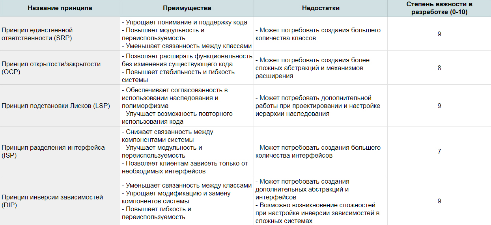

# Принцип инверсии зависимостей

Принцип инверсии зависимостей гласит:

* Модуль высокого уровня не должен зависеть от модулей низкого уровня. 
* И то, и другое должно зависеть от абстракций. 

* Абстракции не должны зависеть от деталей реализации. 

* Детали реализации должны зависеть от абстракций.

Если ваш код уже реализует `принципы открытости/закрытости` и подстановки Лисков, он уже будет неявно согласован с принципом инверсии зависимостей.  

Следуя принципу открытости/закрытости, вы создаете интерфейсы, которые можно использовать для предоставления различных высокоуровневых реализаций. 

Следуя принципу `подстановки Лисков`, вы гарантируете, что сможете заменить экземпляры класса низкого уровня объектами класса высокого уровня без какого-либо негативного воздействия на приложение. 

Таким образом, следуя этим двум принципам, вы гарантируете, что ваши классы высокого уровня и классы низкого уровня зависят от интерфейсов. 


Принцип инверсии зависимостей (Dependency Inversion Principle – DIP) гласит, что классы должны зависеть от абстракций, а не от конкретных реализаций. Высокоуровневые модули не должны зависеть от низкоуровневых модулей. 

Оба типа модулей должны зависеть от абстракций. 

Давайте рассмотрим пример с классами `Notification` и `EmailSender`, чтобы проиллюстрировать принцип `DIP`:

```python
from abc import ABC, abstractmethod


class Notification(ABC):
    @abstractmethod
    def send_notification(self, message):
        pass


class EmailSender(Notification):
    def send_notification(self, message):
        # Логика отправки уведомления по электронной почте
        pass


class SMSNotification(Notification):
    def send_notification(self, message):
        # Логика отправки уведомления по SMS
        pass


class User:
    def __init__(self, username, email):
        self.username = username
        self.email = email
        self.notification_service = EmailSender()

    def send_notification(self, message):
        self.notification_service.send_notification(message)

```

В этом примере класс `User` зависит от конкретной реализации `EmailSender` в качестве сервиса уведомлений.

Это создает прямую связь между `User` и `EmailSender`, что делает классы сложнее для тестирования и внесения изменений.

Чтобы применить `SOLID` принцип `DIP`, мы изменяем `User`, чтобы он зависел от абстракции `Notification`, а не от конкретной реализации:

В этом примере класс `User` зависит от конкретной реализации `EmailSender` в качестве сервиса уведомлений. Это создает прямую связь между `User` и `EmailSender`, что делает классы сложнее для тестирования и внесения изменений.

Чтобы применить `SOLID` принцип `DIP`, мы изменяем `User`, чтобы он зависел от абстракции `Notification`, а не от конкретной реализации:

```python
class User:
    def __init__(self, username, email, notification_service):
        self.username = username
        self.email = email
        self.notification_service = notification_service

    def send_notification(self, message):
        self.notification_service.send_notification(message)

```

Теперь `User` принимает объект `notification_service`, реализующий интерфейс `Notification`, через конструктор. 

Это позволяет передавать различные реализации уведомлений, такие как `EmailSender` или `SMSNotification`, без изменения самого `User`


```python
email_sender = EmailSender()
user = User("John", "john@example.com", email_sender)
user.send_notification("Hello!")

sms_notification = SMSNotification()
user = User("Jane", "jane@example.com", sms_notification)
user.send_notification("Hi there!")
```

Теперь `User` зависит от абстракции `Notification` и может быть легко настроен для работы с различными реализациями уведомлений. Это уменьшает связанность между классами, делает их более гибкими и легкими для тестирования и модификации.

### Выводы

Принцип инверсии зависимостей гласит, что код должен зависеть от абстракций, а не от конкретики. 

Это означает, что код не должен зависеть от конкретных реализаций, а скорее от абстракции, которая затем реализуется. 

Это помогает повысить гибкость и повторное использование кода.

Принципы `SOLID` важны для понимания любого разработчика программного обеспечения. 

Важно помнить, что эти принципы следует применять при разработке программного обеспечения для достижения наилучших результатов. 

`SOLID` принципы могут помочь обеспечить простоту сопровождения и расширения кода в будущем. 

Хорошо понимая SOLID принципы, вы сможете писать код, который будет лучше структурирован, прост в масштабировании и обслуживании.



Рейтинг степени важности в разработке `(0-10)` является относительной оценкой и может различаться в зависимости от конкретной ситуации и контекста разработки.