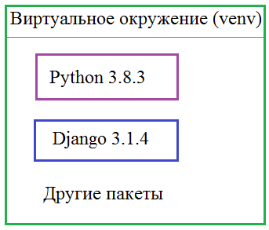
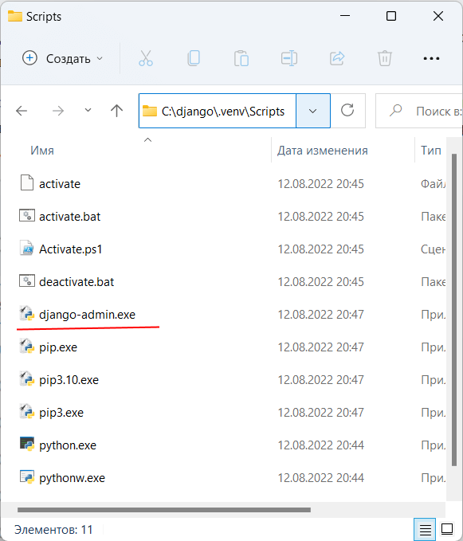
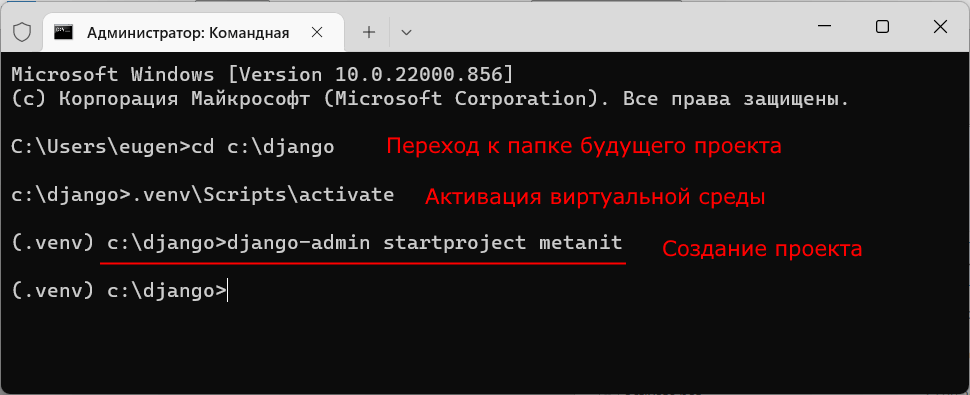
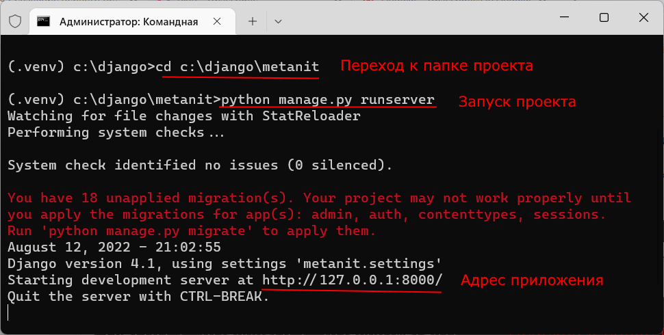
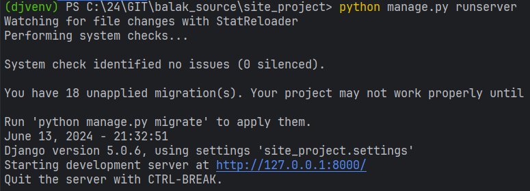
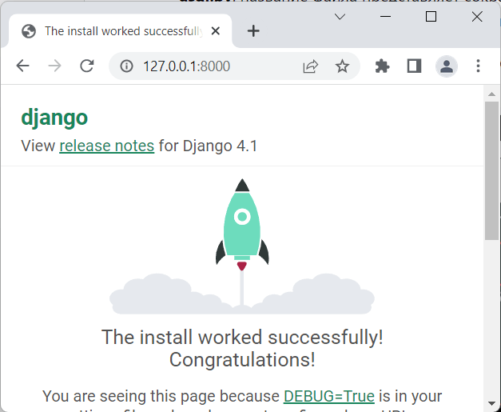
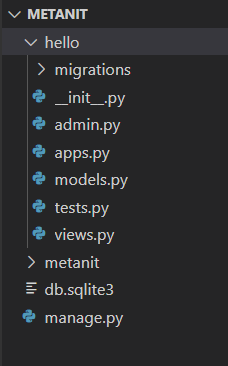
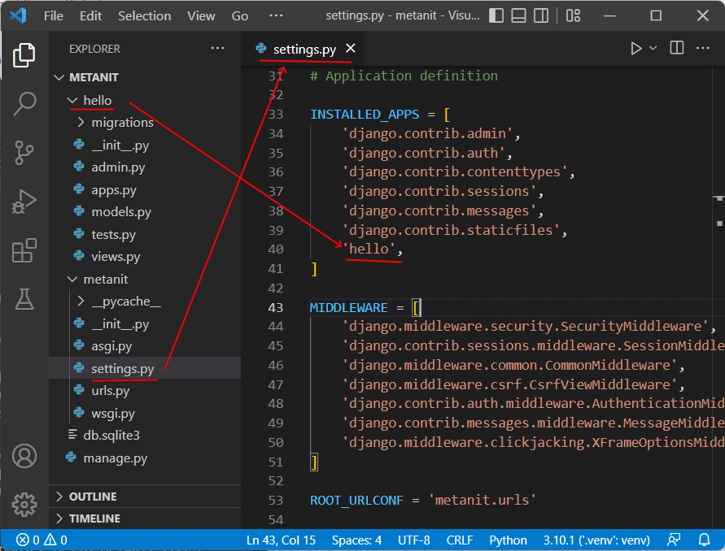
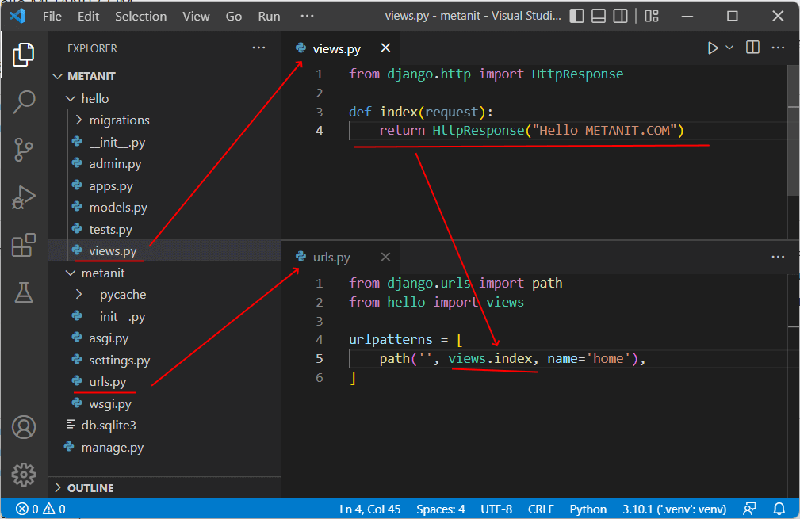

## Установка

Существует несколько вариантов установки, но мы воспользуемся наиболее распространенным – установим официальный релиз в виртуальное окружение (`venv`). 

`Django` – это серьезный фреймворк и часто он взаимодействует с другими пакетами языка `Python`, да и сама версия `Python` может иметь значение. 

Так вот, чтобы все модули согласованно работали и выдавали ожидаемые результаты на запросы пользователей, желательно и на тестовом сервере и на реальном использовать одни и те же версии программных продуктов: начиная с выбранной версии `Django` и заканчивая определенной версией интерпретатора языка `Python`.



Но на компьютере уже могут присутствовать другие версии программных модулей или же их потребуется установить в будущем.

Например, новую версию интерпретатора `Python`.

Это может негативно сказаться на разрабатываемом проекте. 
 
Чтобы этого не происходило, как раз и создается виртуальное окружение, и все что установлено внутри него надежно изолируется от других окружений, в том числе и глобального. 
 
 Мы именно так и поступим – создадим виртуальное окружение и разместим в нем текущую версию языка `Python` и фреймворка `Django`.

Для этого нам понадобится установленный интерпретатор `Python` в глобальном окружении и работа с командной строкой. Если `Python` у вас еще не установлен, то скачайте его с официального сайта:

[https://www.python.org/downloads/](https://skillbox.ru/media/](https://www.`Python`.org/downloads/)) 


Далее, всё будем делать в  `Windows` 

На `Linux` и `MacOS` все происходит похожим образом, но есть отличия. 

Основные из них я буду отмечать по ходу изложения. 

Итак, чтобы работать с командной строкой `Windows`, можно нажать комбинацию клавиш `Win+R` и в появившемся окне набрать команду `cmd`. 

Если все сделаете правильно, то появится вот такое консольное окно:


Для проверки работоспособности интерпретатора `Python` наберем команду:

```sh
Python -V
```
(В `Linux` или MacOS при установке `Python` версии 3 следует использовать команду `Python3 -V)`.

Если все работает, то должны увидеть текущую версию языка. 

Если этого не произошло, то, скорее всего, у вас не установлен Питон в глобальном окружении. 

Далее, с помощью команды:

```sh
pip list
```
Можно посмотреть список установленных пакетов опять же в глобальном окружении, т.к. мы именно в нем сейчас находимся.

Далее, я создам папку, в которой будет устанавливаться виртуальное окружение:

```sh
D:\Python\Projects\Django
```
И в командной строке перейду в этот каталог:


```sh
cd D:\Python\Projects\Django
```
Затем, выполняем команду:
```sh
python -m venv djvenv
```

для создания виртуального окружения с именем `djvenv` в текущей папке. 
(Если вы работаете под `Linux`, то соответственно пишете команду `Python3`).

Все, виртуальное окружение создано, и мы видим дополнительную папку `djvenv`. 

Внутри нее имеются различные вложенные каталоги, которые и определяют содержимое данного окружения. 

Осталось его запустить. 

Находясь в папке `D:\Python\Projects\Django`, выполним команду:
```sh
.\djvenv\Scripts\activate
```
(Если вы работаете под `Linux`, то выполняется команда `source djvenv/bin/activate)`. 

В действительности, мы тем самым запускаем исполняемый файл `activate`, который находится в подкаталоге `\djvenv\Scripts\`. 

В результате должна появиться надпись `(djvenv)`, означающая, что мы находимся в виртуальном окружении с именем `djvenv`. Если теперь выполнить команду:

```sh
pip list
```
то увидим всего два пакета: сам `pip` и `setuptools`. 

То есть, это чистое виртуальное окружение, в котором два пакета и интерпретатор языка ``Python``.

Сразу отмечу, чтобы выйти из виртуального окружения достаточно выполнить команду:

```sh
deactivate
```
и мы возвращаемся в глобальное окружение.

## Установка `Django`


Теперь у нас все готово для установки самого фреймворка `Django` в виртуальное окружение. 

Так как я в своей работе использую интегрированную среду `PyCharm`, то дальнейшие действия по работе с виртуальным окружением буду делать через нее. 

Уверен, что большинство из вас тоже пользуются `PyCharm`, поэтому все должно быть предельно понятно. 

Итак, открываем созданный проект, указав папку:

```sh
D:\Python\Projects\Django`
```

и после индексирования всех файлов интегрированная среда автоматически активизирует установленное виртуальное окружение. Если по каким-то причинам это не произошло, то нужно вручную указать PyCharm это окружение. Для этого следует перейти на вкладку Project Interpreter:
```sh
File -> Settings -> Project:Django -> Project Interpreter
```
и указать интерпретатор из установленного окружения.

Далее, находясь в корневой папке проекта, мы должны выполнить непосредственно установку `Django` с помощью очевидной команды:

```sh
pip install Django==4.2.1
```
После этого в наше виртуальное окружение будет устанавливаться указанная версия этого фреймворка со всеми необходимыми зависимостями. Если теперь выполнить команду:
```sh
pip list
```
то увидим указанную версию `Django` и несколько дополнительных пакетов, необходимых для его работы.

Но это лишь ядро фреймворка с общим функционалом. Используя это ядро, мы можем создавать множество разных сайтов под управлением `Django` в рамках текущего виртуального окружения. 

При установке `Django` в папке виртуальной среды устанавливается утилита `django-admin`. 

А на Windows также исполняемый файл `django-admin.exe`. 

Их можно найти в папке виртуальной среды, в которую производилась установка `Django: на Windows - в подкаталоге Scripts, а на Linux/MacOS - в каталоге bin`.



Чтобы посмотреть список команд ядра, достаточно в терминале записать:
```sh
django-admin
```


`django-admin` предоставляет ряд команд для управления проектом `Django`.
В частности, для создания проекта применяется команда `startproject`. Этой команде в качестве аргумента передается название проекта.

Итак, создадим первый на `Django`. 

Пусть он будет располагаться в той же папке, где располагается каталог виртуальной среды. И для этого вначале активируем ранее созданную виртуальную среду.


Так вот, для создания нашего первого сайта, нам понадобится команда `startproject`, которая записывается так:

```sh
django-admin startproject <имя сайта>
```
Здесь «имя сайта», обычно, является доменным именем. Например, если мы собираемся располагать сайт на домене:

app.ru

то в качестве имени логично выбрать `app`. 

Давайте так и сделаем, выполним команду:

```sh
django-admin startproject app
```





И фреймворк создал папку `app` в рабочей папке проекта. 

Внутри этой папки имеется одноименная вложенная папка пакета, который определяет конфигурацию нашего сайта. 
Созданный каталог будет состоять из следующих элементов:

manage.py: выполняет различные команды проекта, например, создает и запускает приложение

metanit - собственно папка проекта metanit, которая содержит следующие файлы:

__init__.py: данный файл указывает, что папка, в которой он находится, будет рассматриваться как модуль. Это стандартный файл для программы на языке Python.

* settings.py: содержит настройки конфигурации проекта

* urls.py: содержит шаблоны URL-адресов, по сути определяет систему маршрутизации проекта

* wsgi.py: содержит свойства конфигурации `WSGI (Web Server Gateway Inerface)`. 
Он используется при развертывании проекта.

* asgi.py: название файла представляет сокращение от `Asynchronous Server Gateway Interface` и расширяет возможности WSGI, добавляя поддержку для взаимодействия между асинхронными веб-серверами и приложениями.


Поэтому его часто так и называют – пакетом конфигурации. 

Также есть еще один отдельный файл `manage.py`, через который и производится управление данным сайтом. 

Например, мы будем создавать приложение, выполнять `миграции БД`, запускать тестовый веб-сервер и так далее. В действительности, это всего лишь своеобразная утилита, посредник, который передает наши команды `Django-admin` и выполняет их «от лица» нашего сайта. Подробнее обо всем этом мы еще будем говорить.

Давайте теперь запустим тестовый веб-сервер на нашем локальном компьютере и убедимся, что созданный сайт работает. Для этого перейдем в папку `app`:
```sh
cd app
```
и выполним файл `manage.py` с командой runserver:
```sh
python manage.py runserver
```
Происходит запуск локального веб-сервера, который поставляется вместе с `Django`, и наш сайт должен быть доступен по адресу [http://127.0.0.1:8000](http://127.0.0.1:8000).




Преимущество отладочного сервера в том, что он автоматически перезапускается при изменении программы сайта. 



На практике это дает большое удобство. 

Но полностью полагаться на эту возможность не стоит, так как иногда `Django` все же игнорирует изменения, а точнее, новые дополнения, например, новые созданные файлы. 

Поэтому, если вы видите, что что-то работает не так, попробуйте просто перезапустить сервер вручную. 

Для его завершения достаточно нажать комбинацию клавиш:

> Ctrl + Break (а также Ctrl + C в Windows)

а, затем, снова запустить:
```sh
python manage.py runserver
```

Также обратите внимание, что при первом запуске сервера в проекте появился еще один файл `db.sqlite3` – файл БД SQLite3. 

Дело в том, что по умолчанию `Django` использует именно такую СУБД. 

В дальнейшем, мы можем это изменить и указать любую другую СУБД, которую поддерживает данный фреймворк. Это может быть:

> PostgreSQL, MariaDB, MySQL, Oracle и SQLite

Но вернемся к запуску сервера. Его можно запускать также и со следующими параметрами:
```sh
python manage.py runserver 4000
```
или так:
```sh
python manage.py runserver 192.168.1.1:4000
```
надеюсь вы поняли, что из себя представляет фреймворк `Django`, как он устанавливается, как создать проект нового сайта и как проверить его работоспособность с помощью тестового веб-сервера.




## Структура и настройки проекта

Веб-приложение или проект Django состоит из отдельных приложений. 

Вместе они образуют полноценное веб-приложение.

Каждое приложение представляет какую-то определенную функциональность или группу функциональностей. 

Один проект может включать множество приложений. 

Это позволяет выделить группу задач в отдельный модуль и разрабатывать их относительно независимо от других. 

Кроме того, мы можем переносить приложение из одного проекта в другой независимо от другой функциональности проекта.

При создании проекта он уже содержит несколько приложений по умолчанию.

* django.contrib.auth
* django.contrib.admin
* django.contrib.contenttypes
* django.contrib.sessions
* django.contrib.messages
* django.contrib.staticfiles

Список всех приложений можно найти в проекте в файле `settings.py` в переменной `INSTALLED_APPS`:

```python
INSTALLED_APPS = [
    'django.contrib.admin',
    'django.contrib.auth',
    'django.contrib.contenttypes',
    'django.contrib.sessions',
    'django.contrib.messages',
    'django.contrib.staticfiles',
]
```


И, конечно, мы можем создавать свои приложения, которые реализуют определенный функционал. Для создания приложения в проекте применяется команда

```sh
python manage.py startapp название_приложения
```
Так, создадим в проекте, созданном в прошлой теме или новом, первое приложение, которое будет называться bookstore. 

Для этого выполним в командной строке/терминале следующую команду:

```sh
python manage.py startapp bookstore
```
Создание первого приложения на Python с помощью веб-фреймворка Django
В результате в проекте Django будет создано приложение bookstore. И после выполнения этой команды мы увидим в проекте новую папку, которое будет хранить все файлы созданного приложения:

```sh
bookstore World в Django
```

Рассмотрим вкратце его структуру:



папка `migrations`: предназначена для хранения миграций - скриптов, которые позволяют синхронизировать структуру базы данных с определением моделей

* `__init__.py`: указывает интерпретатору python, что текущий каталог будет рассматриваться в качестве пакета

admin.py: предназначен для административных функций, в частности, здесь призводится регистрация моделей, которые используются в интерфейсе администратора

* `apps.py`: определяет конфигурацию приложения

* `models.py`: хранит определение моделей, которые описывают используемые в приложении данные

* `tests.py`: хранит тесты приложения

* `views.py`: определяет функции, которые получают запросы пользователей, обрабатывают их и возвращают ответ

Но пока приложение никак не задействуется. Его надо зарегистрировать в проекте `Django`. 

Для этого откроем файл settings.py и добавим в конец массива INSTALLED_APPS наше приложение:

```python
INSTALLED_APPS = [
    'django.contrib.admin',
    'django.contrib.auth',
    'django.contrib.contenttypes',
    'django.contrib.sessions',
    'django.contrib.messages',
    'django.contrib.staticfiles',
    'bookstore',
]
```



Добавление приложения в `Django`
В проекте может быть несколько приложений, и каждое из них надо добавлять таким вот образом.

Теперь определим какие-нибудь простейшие действия, которые будет выполнять данное приложение, например, отправлять в ответ пользователю строку "bookstore World".

Для этого перейдем в проекте приложения bookstore к файлу views.py, который по умолчанию должен выглядеть следующим образом:

```python
from django.shortcuts import render
# Create your views here.
```
Изменим код следующим образом:

```python
from django.http import HttpResponse
  
def index(request):
    return HttpResponse("bookstore working")
```


В данном случае мы импортируем класс `HttpResponse` из стандартного пакета `django.http`. 

Затем определяется функция `index()`, которая в качестве параметра получает объект запроса `request`. 

Класс `HttpResponse` предназначен для создания ответа, который отправляется пользователю. 

И с помощью выражения `return` `HttpResponse("bookstore working")` мы отправляем пользователю строку `"bookstore working"`

Теперь также в основном проекте `Django` откроем файл `urls.py`, который позволяет сопоставить маршруты с представлениями, которые будут обрабатывать запрос по этим маршрутам. По умолчанию этот файл выглядит следующим образом:

```python
from django.contrib import admin
from django.urls import path
 
urlpatterns = [
    path('admin/', admin.site.urls),
]

```

Первой строкой из модуля `django.contrib` импортируется класс `AdminSite`, который предоставляет возможности работы с интерфейсом администратора. 

Второй строкой из модуля `django.urls` импортируется функция `path`. 

Эта функция задает сопоставление определенного маршрута с функцией обработки. 

Так, в данном случае маршрут `admin/` будет обрабатываться методом `admin.site.urls`.

Но выше мы определили функцию `index` в файле `views.py`, который возвращает пользователю строку `bookstore working`. Поэтому изменим файл `urls.py` следующим образом:

```python
from django.urls import path
from bookstore import views
 
urlpatterns = [
    path('', views.index, name='home'),
]
```

Чтобы использовать функцию `views.index` вначале импортируем модуль `views`. 

Затем определяем сопоставление маршрута ' ' и функции `views.index` и также дополнительно имя для маршрута: name='home'. По сути маршрут ' ' будет сопоставляться с запросом к корню приложения.




### Настройка веб-приложения в Django
Теперь снова запустим приложение командой
```sh
python manage.py runserver
```

И вновь перейдем в браузере по адресу `http://127.0.0.1:8000/`, и браузер нам отобразит строку `"bookstore working"`:
