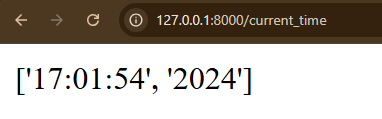
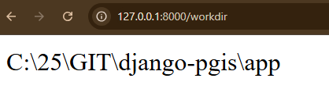
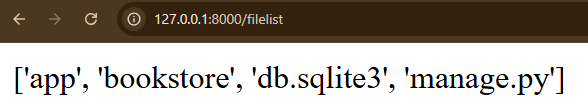
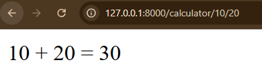
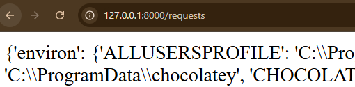
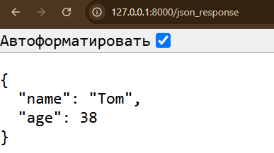

## Простая обработка запросов

Создать эндпоинты:

1) [http://127.0.0.1:8000/current_time](http://127.0.0.1:8000/current_time) - возвращающий текущее время

2) [http://127.0.0.1:8000/workdir](http://127.0.0.1:8000/workdir) - текущую директорию

3) [http://127.0.0.1:8000/filelist](http://127.0.0.1:8000/filelist) - список файлов в текущей директории

4) [http://127.0.0.1:8000/calculator/10/20](http://127.0.0.1:8000/calculator/10/20) - калькулятор

5) [http://127.0.0.1:8000/smart_calc/10**2+50-150](http://127.0.0.1:8000/smart_calc/10**2+50-150) - умный калькулятор

6) [http://127.0.0.1:8000/requests](http://127.0.0.1:8000/requests) - полную инфомацию о запросе

7) [http://127.0.0.1:8000/json_response](http://127.0.0.1:8000/json_response) - передача json

