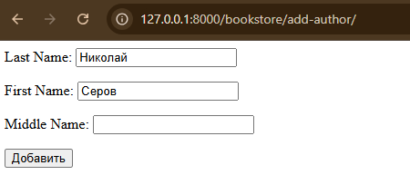
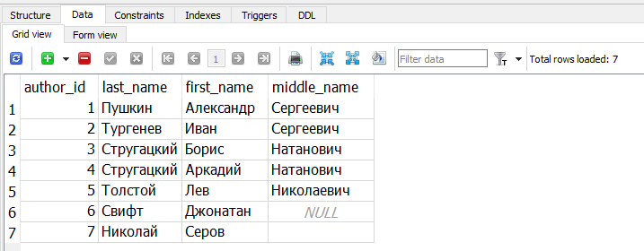
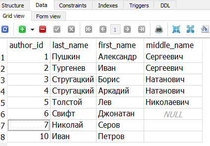

# Использование форм не связанных с моделями

В Django существует специальный класс `Form`, на базе которого удобно создавать формы, не связанные с моделями

Обычно, создают в приложении отдельный файл `forms.py`. 

Мы так и сделаем (создаем файл `bookstore/forms.py`). 

И в этом файле импортируем пакет `forms` и наши модели:
Объявим класс `AddPostForm`, описывающий форму добавления статьи. 
Он будет унаследован от базового класса `Form` и иметь следующий вид:


> forms.py

```python

from django import forms
from .models import Author

class AuthorForm(forms.Form):
    last_name = forms.CharField(label='Last Name', max_length=100)
    first_name = forms.CharField(label='First Name', max_length=100)
    middle_name = forms.CharField(label='Middle Name', max_length=100, required=False)

```


> urls.py

```python
path('add-author/', views.add_author),
```


> views.py


```python
def add_author(request):
    form = AuthorForm()
    return render(request, 'add_author.html', {'form': form})

```


Здесь создается экземпляр формы и через переменную form передается шаблону `add_author.html`. 

Осталось отобразить форму в нашем шаблоне. Перейдем в файл `add_author.html` и пропишем там


> add_author.html

```html
<form action="" method="post">
   {{ form.as_p }}
  <button type="submit">Добавить</button>
</form>
```

Здесь в теге `<form>` через атрибут action в качестве обработчика указана текущая страница (пустые кавычки). 

Атрибут `method` определяет способ передачи информации на сервер (используется POST-запрос). 

В этом случае внутри формы обязательно записываем специальный тег `csrf_token`, который генерирует скрытое поле с уникальным токеном. 

Как я уже отмечал, это необходимо для защиты от `CSRF-атак`, когда вредоносный сайт пытается отправить данные от имени авторизованного пользователя. 

`Django` не станет обрабатывать данные, если отсутствует или не совпадает csrf-токен и, тем самым, защищает пользователя от подобных атак.

Следующая строчка {{ form.as_p }} вызывает метод as_p объекта формы для отображения ее полей с тегами абзацев <p>. 

Существуют и другие методы, которые формируют поля в виде элементов списка <ul> или в виде таблицы. 

Последний вариант, хоть и возможен, но считается устаревшей практикой. 

Здесь также стоит иметь в виду, что по умолчанию все поля в Django обязательны, если не указано обратное через параметр `required=False`.

Наконец, последняя строчка – тег `<button>` создает кнопку типа `submit` для отправки данных формы на сервер и, в конечном итоге, нашей функции представления `addpage()`.

Если теперь обновить страницу, то увидим все указанные поля формы со списком и кнопкой. 


# Обработка данных формы


Форма в простейшем варианте у нас с вами готова. 

Конечно, она пока выглядит неказисто, зато обладает нужным функционалом. 

Давайте теперь посмотрим, как можно обработать данные этой формы на стороне сервера, то есть в функции представления `add_author()`.

Для этого определим функцию `addpost()` следующим образом:


```python
def add_author(request):
    if request.method == 'POST':
        form = AuthorForm(request.POST)
        if form.is_valid():
           print(form.cleaned_data)
    else:
        form = AuthorForm()
    return render(request, 'add_author.html', {'form': form})

```



> {'last_name': 'Николай', 'first_name': 'Серов', 'middle_name': ''}


Как это работает? Смотрите, вначале приходит обычный GET-запрос от браузера для открытии страницы по маршруту:

`http://127.0.0.1:8000/addpage/`

В итоге, условие не срабатывает и создается форма с пустыми полями, которая передается в шаблон и он, затем, отображается в браузере. 

Именно поэтому мы видим форму без данных. Далее, пользователь заполняет ее поля и отправляет на сервер по POST-запросу. Снова срабатывает наша функция представления addpost() и на этот раз проверка проходит. 

Формируется объект формы с переданными данными и вызывается метод формы `is_valid()`, который проверяет поля на корректность заполнения. 

Если проверка прошла, то в консоли отобразится словарь form.cleaned_data полученных данных от пользователя. 

Если же проверка не пройдет, то пользователь увидит сообщение об ошибке.

Давайте запустим веб-сервер, заполним нашу форму и нажмем на кнопку «Добавить». 

Если все заполнено корректно, то метод `is_valid()` вернет `True` и в консоли отобразятся, так называемые, очищенные данные `cleaned_data`. 

При этом страница перезагрузится, но введенные данные не пропадут, так как мы в шаблон передаем объект form с заполненными полями, а не пустую.

Если же заполнить форму с ошибками, например в поле slug указать русские символы, то фреймворк Django автоматически сформирует сообщение об ошибке, что в поле slug присутствуют недопустимые символы. 

Соответственно, метод is_valid() в этом случае вернет False и коллекция cleaned_data не будет отображена в консоли. 

Видите, как это удобно? 

Нам самим даже не нужно делать обработку типовых ошибок. 

Фреймворк Django все берет на себя.


# Добавление новой записи

```python
if form.is_valid():
    last_name = form.cleaned_data['last_name']
    first_name = form.cleaned_data['first_name']
    middle_name = form.cleaned_data['middle_name']
    author = Author(last_name=last_name, first_name=first_name, middle_name=middle_name)
    author.save()
    # return redirect('get_authors')
```




Рефакторим

```python
def add_author(request):
    if request.method == 'POST':
        form = AuthorForm(request.POST)
        if form.is_valid():
            Author.objects.create(**form.cleaned_data)
            return redirect('get_authors')          
    else:
        form = AuthorForm()
    return render(request, 'add_author.html', {'form': form})
```


```python
path('add-author/', views.add_author, name='get_authors'),
```



Мы здесь используем `ORM Django` для формирования новой записи в таблице women и передаем в метод `create()` распакованный словарь полученных данных. 

Так как метод `create()` может генерировать исключения, то помещаем его вызов в блок `try` и при успешном выполнении, осуществляется перенаправление на главную страницу. 

Если же возникли какие-либо ошибки, то попадаем в блок `except` и формируем общую ошибку для ее отображения в форме.

Давайте, для начала введем корректные данные в форму, тогда после нажатия на кнопку `«Добавить»` в таблице `women` появится новая запись с заполненными полями.

Вернемся в форму и попробуем добавить статью с неуникальным слагом. 

Тогда возникнет исключение, и мы увидим сообщение `«Ошибка добавления поста»`. 

Как видите, все достаточно просто.

Это был пример использования формы не связанной с моделью. 

В результате, нам пришлось в классе `AddPostForm` дублировать поля, описанные в модели `Women` и, кроме того, вручную выполнять сохранение данных в таблицу `women`. 

Далее мы увидим, как все это можно автоматизировать, используя форму в связке с моделью.

# Валидация полей формы. Создание пользовательского валидатора