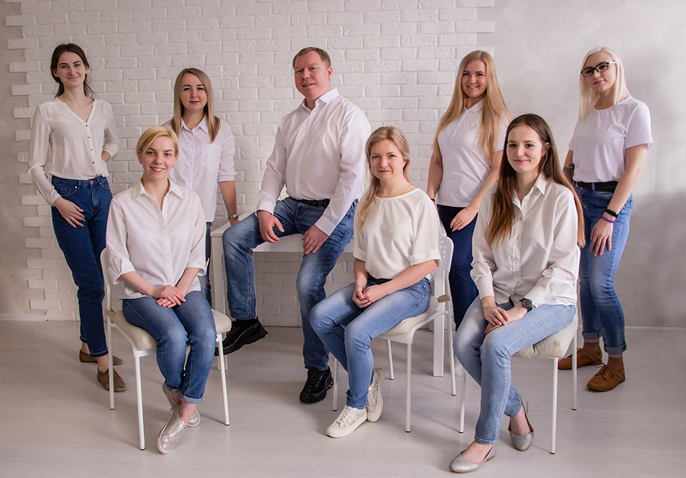

# Программирование на языке Python. 

## Основы программирования на Python для разработки и оптимизации алгоритмов пространственного анализа в КГИС и гидравлических расчётов в PipeSIM.

### Программа курса

## Модуль 1. Начало работы
* Версии и реализации языка Python
* Основные принципы работы интерпретатора Python
* Установка интерпретатора и среды разработки используемых на курсе
* Основные элементы программирования

## Модуль 2. Управляющие конструкции
* Строка как последовательность
* Ветвление
* Циклы
* Простой ввод и простой вывод
* Последовательности и циклы
* Практикум

## Модуль 3. Функции и коллекции
* Список
* Кортеж
* Последовательность range
* Словарь
* Перебор (for)
* Функция
* Генератор-функция

## Модуль 4. Модули и пакеты
* Создание собственного модуля
* Создание пакета
* Подсистема pip
* Краткий обзор стандартной библиотеки
* Установка стороннего модуля
* Практикум 

## Модуль 5. Работа с файловой системой
* Работа с файлами
* Работа с каталогами
* Обработка параметров командной строки
* Практикум

## Модуль 6. Исключения и обработка ошибок
* Понятие об исключении
* Выброс исключения
* Перехват исключения
* Стандартные исключения
* Практикум

## Модуль 7. Регулярные выражения и основы синтаксического разбора
* Понятие о регулярном выражении
* Синтаксис регулярных выражений
* Применение регулярных выражений
* Практикум

## Модуль 8. Элементы функционального программирования

*	Функция как объект. Паттерн «Фабрика функций»
*	Анонимные функции. Сортировка коллекций по ключу
*	Применение функций `all` и `any`
*	Функции высшего порядка (`map, filter, reduce`)
*	Модуль `itertools` и комбинаторика
*	Практические задачи
*	Глобальный и локальный контекст
*	Замыкания функций
*	Декораторы функций
*	Встроенные декораторы*	
*	Практические задачи

## Модуль 9. Алгоритмы поиска на графах

*	Жадные алгоритмы
*	Алгоритмы на графах
*	Алгоритмы поиска `(BFS, DFS, Dijkstra)`
*	Понятие сложности алгоритма
*	Практические задачи

## Модуль 10. Введение в ООП
*	Эволюция парадигм программирования и актуальность ООП
*	Класс и экземпляр класса
*	Методы классов
*	Конструктор класса
*	Инкапсуляция и доступ к содержимому класса
*	Практические задачи

## Модуль 11. Предопределённые магические (dunder) методы в ООП

*	Метод `__call__`. Функторы и классы-декораторы
*	Метод `__new__`. Паттерн синглетон*	
*	Слоты. Коллекция `__slots__`
*	Паттерн моносостояние
*	Практические задачи

## Модуль 12. Магические методы и перегрузка операторов

*	Магические методы `__add__, __sub__, __mul__`
*	Методы сравнений `__eq__, __ne__, __lt__, __gt__` 
*	Магические методы `__eq__ и __hash__`
*	Магический метод `__bool __` определения правдивости объектов
*	Магические методы `__getitem__, __setitem__ и __delitem__`
*	Генераторы и итераторы. Магические методы `__iter__ и __next__`
*	Практические задачи

## Модуль 13. Наследование 

*	Понятия базового класса и производного класса. Утиная типизация
*	Наследование от встроенных типов
*	Атрибуты `private и protected` при наследовании. 
*	Практические задачи

## Модуль 14. Полифорфизм и абстрактные классы. 

*	Суть полиморфизма
*	Абстрактные методы
*	Класс Enum
*	Методы класса и статические методы
*	Практические задачи

## Модуль 15. Множественное наследование и абстракция 

*	Множественное наследование
*	Миксины
*	Декрипторы классов
*	Абстрактные классы
*	Наследование исключений
*	Менеджеры контекстов. Оператор `with`
*	Практические задачи

## Модуль 16. Хранение данных вне программы. Сериализация

* Получение данных из разных источников. Модули `csv, json`.
* Сохранение и восстановление данных. Библиотечный модуль `pickle`.
* Работа с БД на примере модуля `sqlite3`.
* *Работа с файлами `Excel`

## Модуль 17. Web-разработка с применением концепции MVC
* История и развитие веб-программирования, различные подходы.
* Идеи `MVC-подхода`: разделение логики, интерфейса и данных.
* Установка Web-фреймворка `Django`.
* Структура проекта.

## Модуль 18. Основы использования шаблонов
* Передача данных из приложения в шаблоны.
* Использование циклов и выбора в шаблонах.

## Модуль 19. Хранение и работа с данными
* Способы хранения данных
* Создание и администрирование БД.
* Схема БД: таблицы, связи между ними, ключи.
* Отображение данных в БД на объекты приложения (ORM).
* Реализация операций выборки, создания, удаления и изменения объектов.

## Модуль 20. Использование форм
* Специальные средства создания форм.
* Проверка параметров форм.

## Модуль 21. Разграничение прав доступа пользователей
* Авторизация пользователей и разграничение прав доступа.
* Сессии, не требующие регистрации.
* Безопасность.

## Модуль 22. Сложные запросы к данным
* Реализация сложных запросов.
* Соединение запросов, подзапросы.
* Вызов хранимых процедур.

## Модуль 23. Расширенные возможности шаблонного механизма
* Встроенные фильтры.
* Создание своих фильтров.

## Модуль 24. Выдача данных в форматах, отличных от HTML
* Отделение статического контента от динамического.
* Отправка почтовых уведомлений.
* Отдача лент новостей.
* Генерация PDF-документов

## Модуль 25. Средства отладки и тестирования
* Журналирование.
* Встроенный интерфейс администрирования.
* Модульное тестирование.

## Модуль 26. Развертывание веб-приложений
* Использование встроенного веб-сервера, CGI, FastCGI и mod_python.
* Развертывание и миграция БД.

## Модуль 27. Установка и настройка программного обеспечения. Базовый инструментарий.
* Принципы организации и управления вычислениями. Используемые языки программирования и взаимосвязь
между ними.
* Необходимые пакеты `Python`: `numpy, Matplotlib, Pandas, Jupyter` и другие.
* Дистрибутив Anaconda, его преимущества и недостатки.
* Установка пакетов в `Linux`.
* Установка пакетов в `Windows`. Возможные проблемы и методы их решения.

## Модуль 28. Библиотека `numpy`. Вычислительные задачи.
* Понятие массива и его основные характеристики.
* Структура библиотеки.
* Типы данных библиотеки `numpy`.
* Принципы вычислений.
* Универсальные функции.
* Важнейшие стандартные функции.

## Модуль 29. Библиотека Matplotlib. Визуализация данных.
* Виды графиков и диаграмм.
* Основные элементы диаграммы.
* Создание диаграммы.
* Форматы изображений

## Модуль 30. Библиотека Pandas. Статистика и анализ
* Объект Series.
* Объект DataFrame.
* Загрузка и выгрузка данных.
* Организация колонок и строчек.
* Пропуски и повторы.

## Модуль 31. Статистика. Временные ряды.
* Типы данных для представления времени.
* Объект Period.
* Основные операции статистики. 
* Объединение данных.
* Сцепление и наложение (concatenating and stacking).
* Слияние (merging and joining).

# Учебный центр "Шифт"

Учебный центр «ШИФТ» специализируется на обучении IT специалистов, обучает мировым лидерам IT-отрасли, готовит специалистов высокого класса к реальной практической работе.

За это время было разработано более 100 специализированных курсов: для программистов, системных администраторов, системных аналитиков, разработчиков и т.д.

Кроме этого, Школа информационных и финансовых технологий подготавливает профессионалов по направлению автоматизированного проектирования, обучает офисный персонал организации, и проводит тренинги, начиная от малого бизнеса заканчивая корпорациями. 

Преподаватели учебного центра вкладывают все свои знания, умения и навыки с огромным практическим опытом в каждого слушателя.

Учебные классы полностью укомплектованы оборудованием для комфортного обучения, оснащены современной техникой и презентационным оборудованием.

[https://www.eshift.ru/o-nas/uchebnyy-tsentr-shift/](https://www.eshift.ru/o-nas/uchebnyy-tsentr-shift/)